---
## Front matter
title: "**Отчет по лабораторной работе №3**"
subtitle: "дисциплина:	Архитектура компьютера"
author: "Колобова Елизавета Андреевна НММбд-01"

## Generic otions
lang: ru-RU
toc-title: "Содержание"

## Bibliography
bibliography: bib/cite.bib
csl: pandoc/csl/gost-r-7-0-5-2008-numeric.csl

## Pdf output format
toc: true # Table of contents
toc-depth: 2
lof: true # List of figures
lot: true # List of tables
fontsize: 12pt
linestretch: 1.5
papersize: a4
documentclass: scrreprt
## I18n polyglossia
polyglossia-lang:
  name: russian
  options:
	- spelling=modern
	- babelshorthands=true
polyglossia-otherlangs:
  name: english
## I18n babel
babel-lang: russian
babel-otherlangs: english
## Fonts
mainfont: PT Serif
romanfont: PT Serif
sansfont: PT Sans
monofont: PT Mono
mainfontoptions: Ligatures=TeX
romanfontoptions: Ligatures=TeX
sansfontoptions: Ligatures=TeX,Scale=MatchLowercase
monofontoptions: Scale=MatchLowercase,Scale=0.9
## Biblatex
biblatex: true
biblio-style: "gost-numeric"
biblatexoptions:
  - parentracker=true
  - backend=biber
  - hyperref=auto
  - language=auto
  - autolang=other*
  - citestyle=gost-numeric
## Pandoc-crossref LaTeX customization
figureTitle: "Рис."
tableTitle: "Таблица"
listingTitle: "Листинг"
lofTitle: "Список иллюстраций"
lotTitle: "Список таблиц"
lolTitle: "Листинги"
## Misc options
indent: true
header-includes:
  - \usepackage{indentfirst}
  - \usepackage{float} # keep figures where there are in the text
  - \floatplacement{figure}{H} # keep figures where there are in the text
---

# **Цель работы**

Целью работы является изучить идеологию и применение средств контроля версий. Приобрести практические навыки по работе с системой git.

# **Задание**

Выполнение настройки и работа с системой контроля версий Git 

# **Выполнение лабораторной работы**
 1. **Настройка github** 
Для выполнения лабораторных работ предлагается использовать Github. Создадим учётную запись на сайте https://github.com/ и заполним основные данные. (рис. 1)

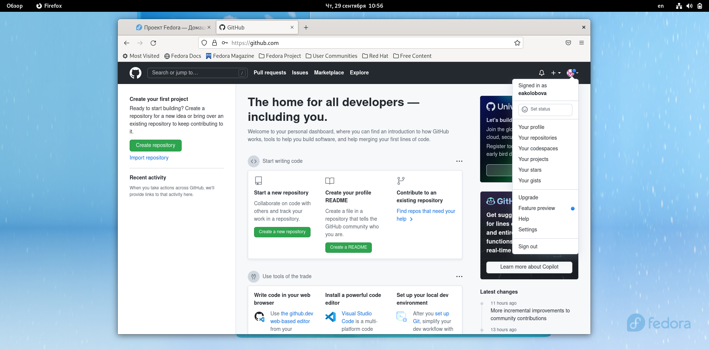{#fig:fig1 width=70%}

2. **Базовая настройка git** 
Сначала сделаем предварительную конфигурацию git. Откроем терминал и введем следующие команды, указав имя и email владельца репозитория (рис. 2): 
git config --global user.name "" 
git config --global user.email "" 

{#fig:fig2 width=70%}

Настроим utf-8 в выводе сообщений git (рис. 3): 
git config --global core.quotepath false

{#fig:fig3 width=70%}

Зададим имя начальной ветки (будем называть её master) (рис. 4, 5): 
git config --global init.defaultBranch master 
Параметр autocrlf: git config --global core.autocrlf input 
Параметр safecrlf: git config --global core.safecrlf warn 

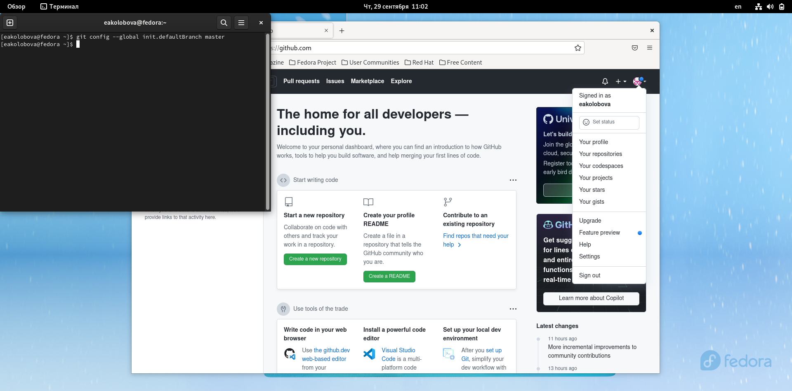{#fig:fig4 width=70%}

{#fig:fig5 width=70%}

3. **Создание SSH ключа** 
Для последующей идентификации пользователя на сервере репозиториев необходимо сгенерируем приватный и открытый ключи (рис. 6, 7): 
ssh-keygen -C "Имя Фамилия " 

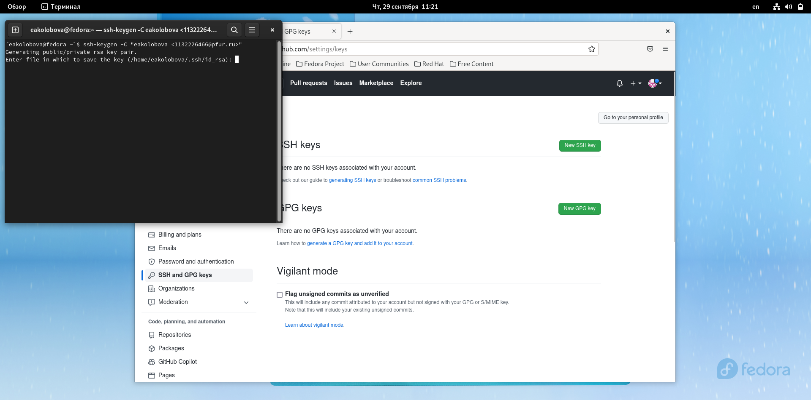{#fig:fig6 width=70%}

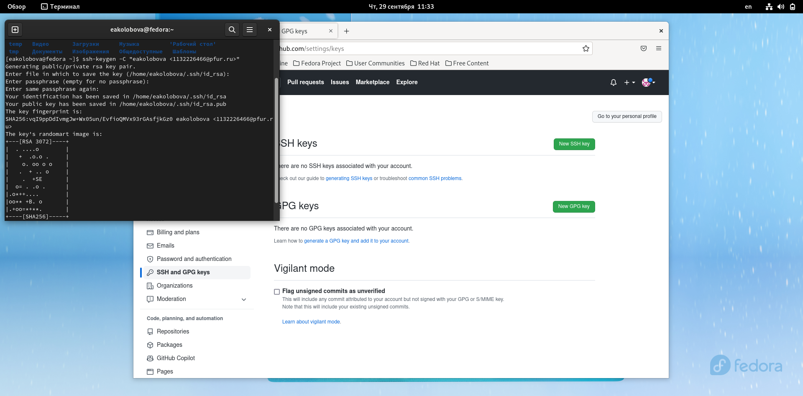{#fig:fig7 width=70%}

Ключи сохранятся в каталоге ~/.ssh/. 
Загрузим сгенерённый открытый ключ. Зайдем на сайт http://github.org/ под своей учётной записью и перейдем в меню Setting. После этого выберем в боковом меню SSH and GPG keys и нажимаем кнопку New SSH key. Скопировав из локальной консоли ключ в буфер обмена 
(рис. 8) 
cat ~/.ssh/id_rsa.pub | xclip -sel clip 

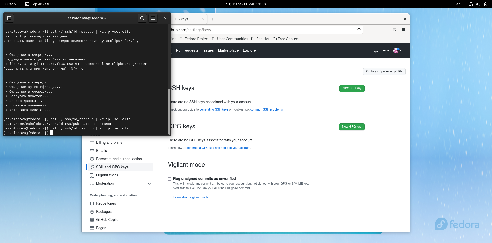{#fig:fig8 width=70%}

вставляем ключ в появившееся на сайте поле и указываем для ключа имя (Title) (рис. 9, 10). 

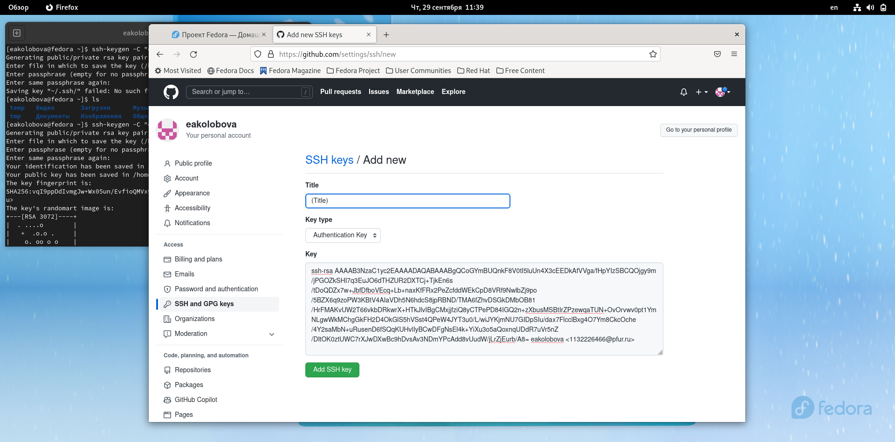{#fig:fig9 width=70%}

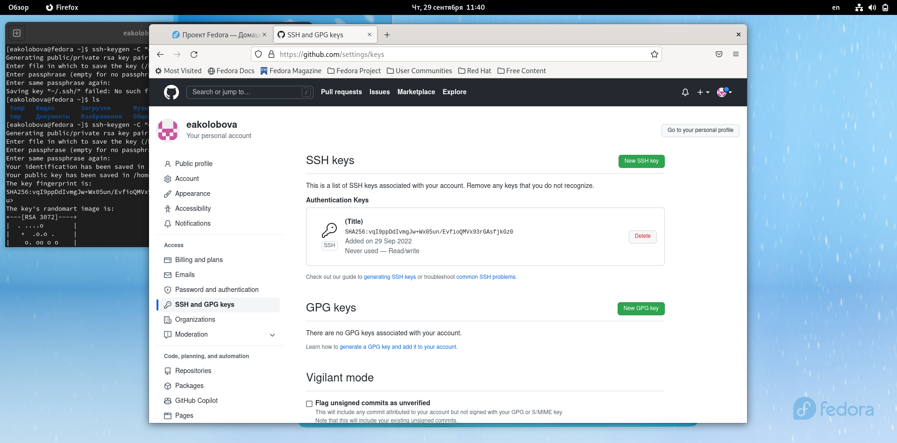{#fig:fig10 width=70%}

4. **Сознание рабочего пространства и репозитория курса на основе шаблона** 
Откроем терминал и создадим каталог для предмета «Архитектура компьютера» (рис. 11): 
mkdir -p ~/work/study/2022-2023/"Архитектура компьютера" 

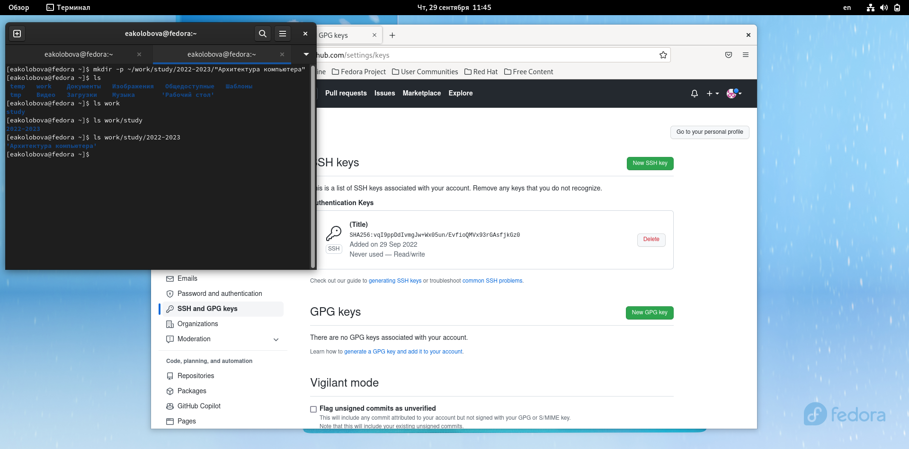{#fig:fig11 width=70%}

5. **Сознание репозитория курса на основе шаблона** 
Перейдем на страницу репозитория с шаблоном курса (рис. 12)
https://github.com/yam adharma/course-directory-student-template. 

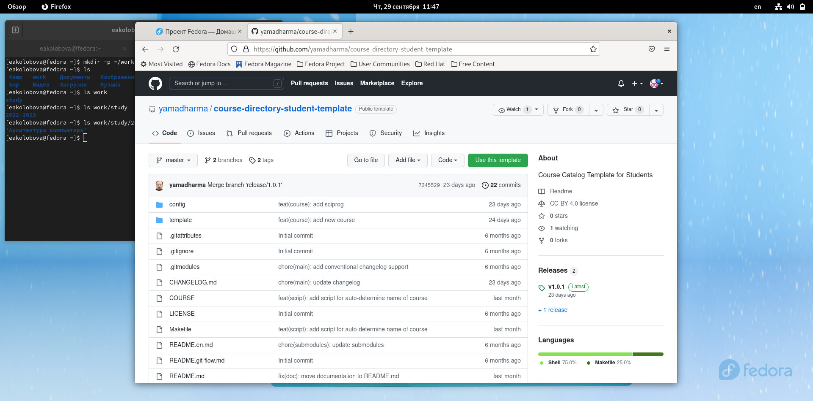{#fig:fig12 width=70%}

Далее выберем Use this template. В открывшемся окне зададим имя репозитория study_2022–2023_arh-pc и создадим репозиторий (рис. 13, 14). 

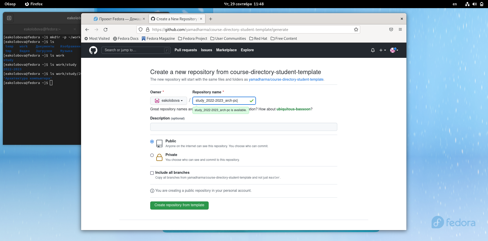{#fig:fig13 width=70%}

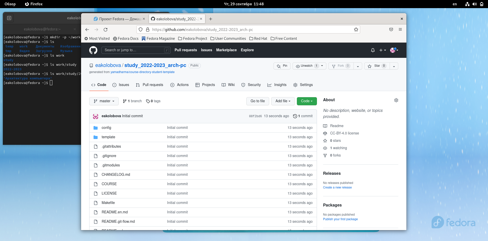{#fig:fig14 width=70%}

Откроем терминал и перейдем в каталог курса: 
cd ~/work/study/2022-2023/"Архитектура компьютера" 
клонируйте созданный репозиторий (рис. 15, 16): 
git clone --recursive ↪ git@github.com:/study_2022–2023_arh-pc.git arch-pc 

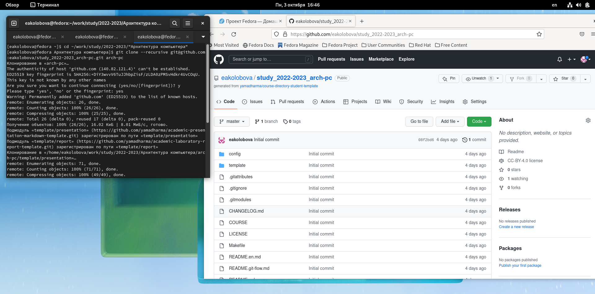{#fig:fig15 width=70%}

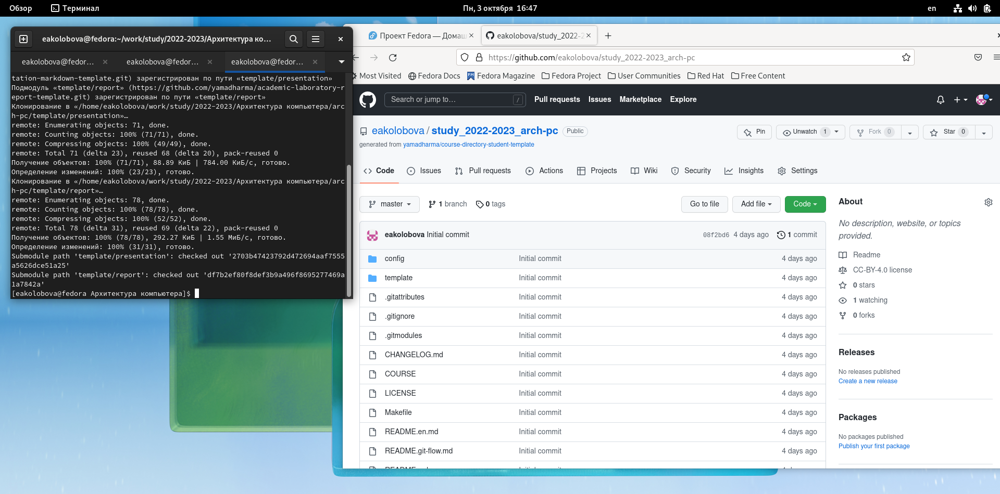{#fig:fig16 width=70%}

6. **Настройка каталога курса**
Перейдем в каталог курса: 
cd ~/work/study/2022-2023/"Архитектура компьютера"/arch-pc 
Удалим лишние файлы (рис. 17): 
rm package.json 

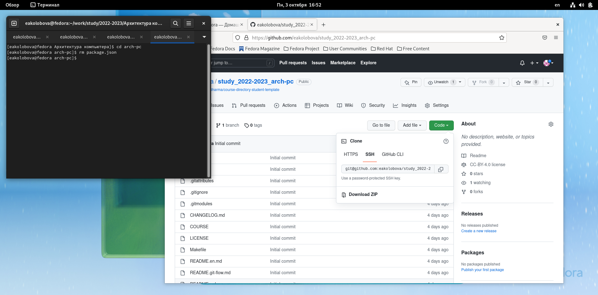{#fig:fig17 width=70%}

Создадим необходимые каталоги (рис. 18): 
echo arch-pc > COURSE 
make 
Отправим файлы на сервер (рис. 18): 
git add . 
git commit -am 'feat(main): make course structure' 
git push 

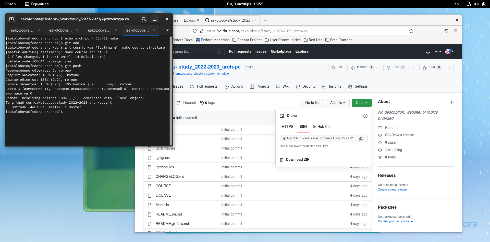{#fig:fig18 width=70%}

## **Задание для самостоятельной работы** 
1. Создайте отчет по выполнению лабораторной работы в соответствующем каталоге рабочего пространства (labs>lab03>report) (рис. 19)

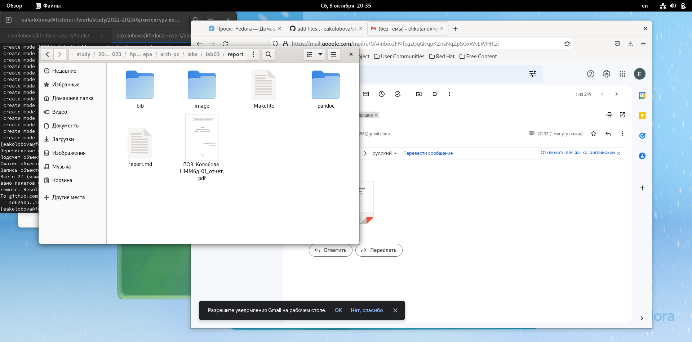{#fig:fig19 width=70%}

2. Скопируйте отчеты по выполнению предыдущих лабораторных работ в соответствующие каталоги созданного рабочего пространства. (рис. 20, 21)

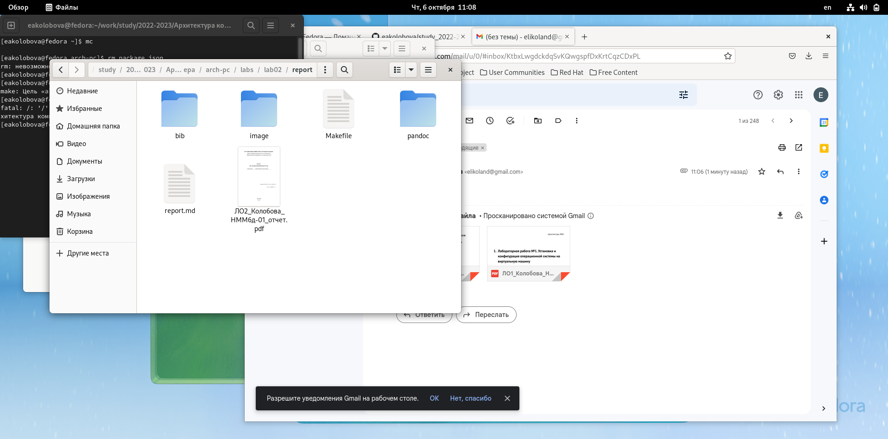{#fig:fig20 width=70%}

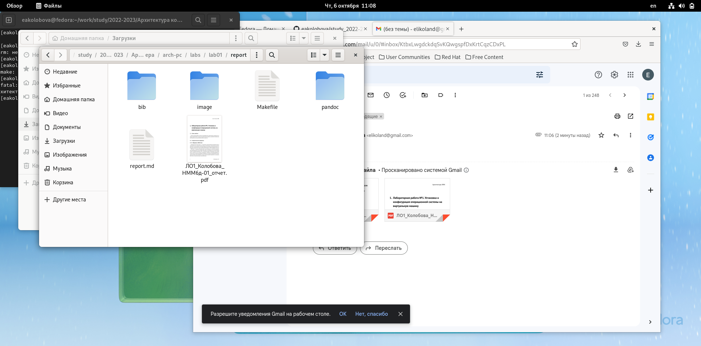{#fig:fig21 width=70%}

3. Загрузите файлы на github. (рис. 22, 23, 24)

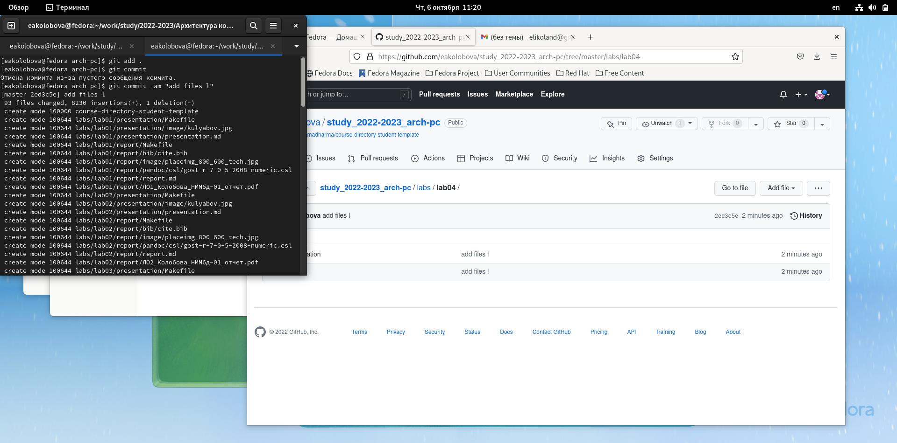{#fig:fig22 width=70%}

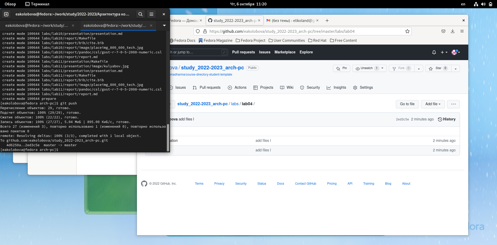{#fig:fig23 width=70%}

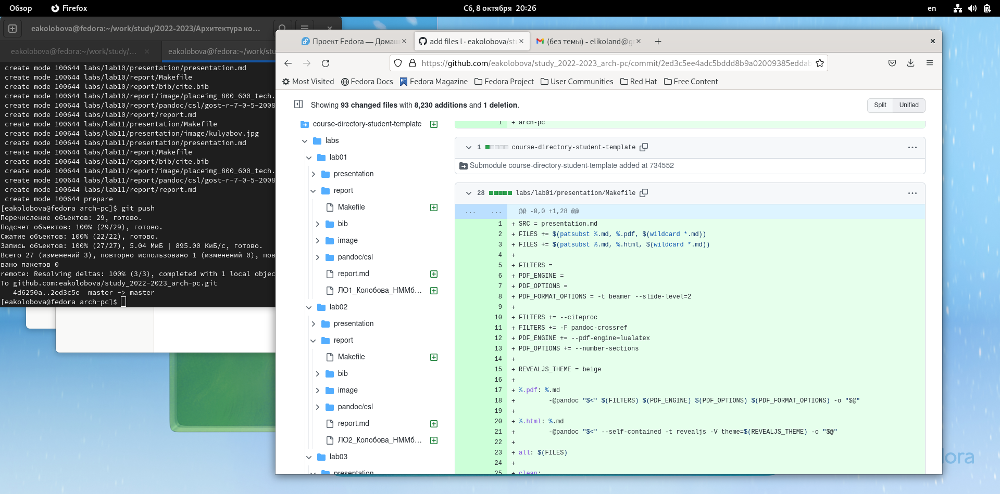{#fig:fig24 width=70%}

# **Выводы**
По итогам проделанной работы мы научились выполнять настройку и работать с системой контроля версий Git 

