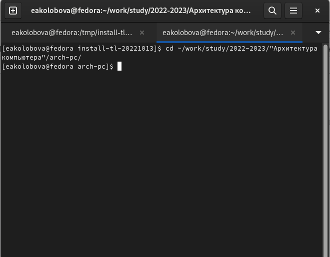
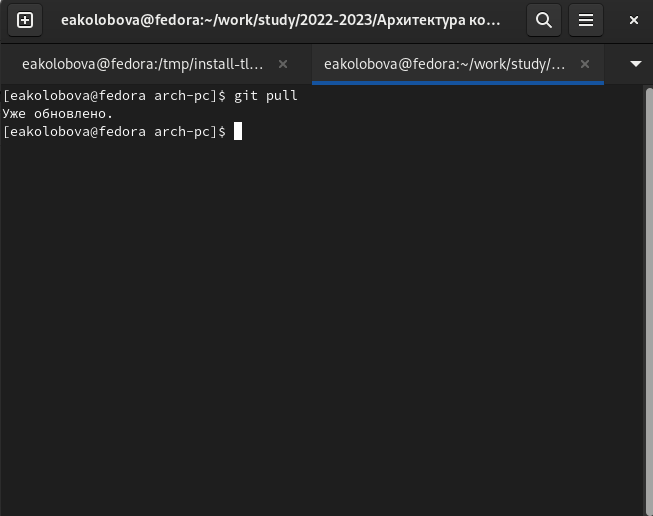
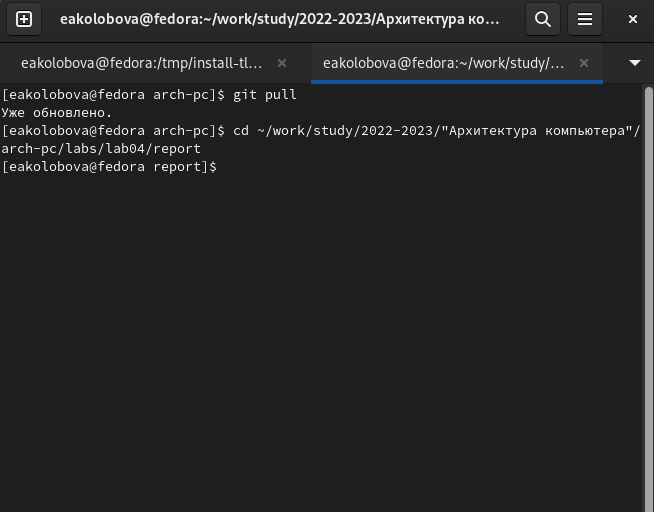
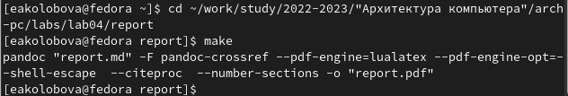
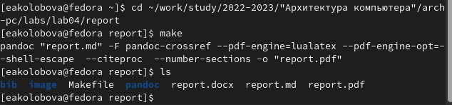
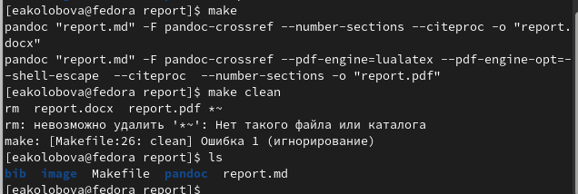

---
## Front matter
title: "**Отчет по лабораторной работе №4**"
subtitle: "дисциплина: Архитектура компьютера"
author: "Колобова Елизавета Андреевна НММбд-01"

## Generic otions
lang: ru-RU
toc-title: "Содержание"

## Bibliography
bibliography: bib/cite.bib
csl: pandoc/csl/gost-r-7-0-5-2008-numeric.csl

## Pdf output format
toc: true # Table of contents
toc-depth: 2
lof: true # List of figures
lot: true # List of tables
fontsize: 12pt
linestretch: 1.5
papersize: a4
documentclass: scrreprt
## I18n polyglossia
polyglossia-lang:
  name: russian
  options:
	- spelling=modern
	- babelshorthands=true
polyglossia-otherlangs:
  name: english
## I18n babel
babel-lang: russian
babel-otherlangs: english
## Fonts
mainfont: PT Serif
romanfont: PT Serif
sansfont: PT Sans
monofont: PT Mono
mainfontoptions: Ligatures=TeX
romanfontoptions: Ligatures=TeX
sansfontoptions: Ligatures=TeX,Scale=MatchLowercase
monofontoptions: Scale=MatchLowercase,Scale=0.9
## Biblatex
biblatex: true
biblio-style: "gost-numeric"
biblatexoptions:
  - parentracker=true
  - backend=biber
  - hyperref=auto
  - language=auto
  - autolang=other*
  - citestyle=gost-numeric
## Pandoc-crossref LaTeX customization
figureTitle: "Рис."
tableTitle: "Таблица"
listingTitle: "Листинг"
lofTitle: "Список иллюстраций"
lotTitle: "Список таблиц"
lolTitle: "Листинги"
## Misc options
indent: true
header-includes:
  - \usepackage{indentfirst}
  - \usepackage{float} # keep figures where there are in the text
  - \floatplacement{figure}{H} # keep figures where there are in the text
---

# **Цель работы**

Целью работы является освоение процедуры оформления отчетов с помощью
легковесного языка разметки Markdown.

# **Задание**

В соответствующих каталогах сделать отчёты по лабораторным работам No 3, 4
в формате Markdown.

# **Выполнение лабораторной работы**
1. Откроем терминал
2. Переходим в каталог курса сформированный при выполнении лаборатор-
ной работы No3 (рис. 1):

cd ~/work/study/2022-2023/"Архитектура компьютера"/arch-pc/

{ #fig:001 width=70% }

Обновляем локальный репозиторий, скачав изменения из удаленного репози-
тория (рис. 2)

git pull 

{ #fig:002 width=70% }

3. Переходим в каталог с шаблоном отчета по лабораторной работе No 4 (рис. 3)

cd ~/work/study/2022-2023/"Архитектура компьютера"/arch-pc/labs/lab04/report

{ #fig:003 width=70% }

4. Проводим компиляцию шаблона с использованием Makefile. (рис. 4)

make

{ #fig:004 width=70% }

5. Удаляем полученные файлы с использованием Makefile. (рис.5) 

make clean

{ #fig:005 width=70% }

6. Открываем файл report.md c помощью любого текстового редактора, (использован gedit) (рис.6)

gedit report.md

{ #fig:006 width=70% }

7. Заполняем отчет и компилируем отчет с использованием Makefile. Про-
веряем корректность полученных файлов. 

8. Загружаем файлы на Github.

cd ~/work/study/2022-2023/"Архитектура компьютера"/arch-pc

git add .

git commit -am 'feat(main): add files lab-4'

git push

## **Задание для самостоятельной работы**
1. В соответствующем каталоге (labs/lab03) делаем отчёт по лабораторной работе No 3
в формате Markdown. В качестве отчёта предоставлены отчёты
в 3 форматах: pdf, docx и md.
2. Загружаем файлы на github.

git add .

git commit -am 'feat(main): add files lab-4'

git push

Ссылка на репозиторий: https://github.com/eakolobova/study_2022-2023_arch-pc/tree/master/labs/lab03/report

# **Выводы**

Результатом проведенной работы является освоение процедуры оформления отчетов с помощью
легковесного языка разметки Markdown.

