---
## Front matter
title: "**Отчет по лабораторной работе №5**"
subtitle: "дисциплина: Архитектура компьютера"
author: "Колобова Елизавета Андреевна НММбд-01"

## Generic otions
lang: ru-RU
toc-title: "Содержание"

## Bibliography
bibliography: bib/cite.bib
csl: pandoc/csl/gost-r-7-0-5-2008-numeric.csl

## Pdf output format
toc: true # Table of contents
toc-depth: 2
lof: true # List of figures
lot: true # List of tables
fontsize: 12pt
linestretch: 1.5
papersize: a4
documentclass: scrreprt
## I18n polyglossia
polyglossia-lang:
  name: russian
  options:
	- spelling=modern
	- babelshorthands=true
polyglossia-otherlangs:
  name: english
## I18n babel
babel-lang: russian
babel-otherlangs: english
## Fonts
mainfont: PT Serif
romanfont: PT Serif
sansfont: PT Sans
monofont: PT Mono
mainfontoptions: Ligatures=TeX
romanfontoptions: Ligatures=TeX
sansfontoptions: Ligatures=TeX,Scale=MatchLowercase
monofontoptions: Scale=MatchLowercase,Scale=0.9
## Biblatex
biblatex: true
biblio-style: "gost-numeric"
biblatexoptions:
  - parentracker=true
  - backend=biber
  - hyperref=auto
  - language=auto
  - autolang=other*
  - citestyle=gost-numeric
## Pandoc-crossref LaTeX customization
figureTitle: "Рис."
tableTitle: "Таблица"
listingTitle: "Листинг"
lofTitle: "Список иллюстраций"
lotTitle: "Список таблиц"
lolTitle: "Листинги"
## Misc options
indent: true
header-includes:
  - \usepackage{indentfirst}
  - \usepackage{float} # keep figures where there are in the text
  - \floatplacement{figure}{H} # keep figures where there are in the text
---

# **Цель работы**

Целью работы является освоение процедуры компиляции и сборки программ, написанных на ассемблере NASM.

# **Задание**

В соответствующих каталогах сделать отчёты по лабораторным работам No 3, 4
в формате Markdown.

# **Выполнение лабораторной работы**
1. Создаем каталог для работы с программами на языке ассемблера NASM (рис. 1)
> mkdir ~/work/arch-pc/lab05
Переходим в созданный каталог (рис. 1)
> cd ~/work/arch-pc/lab05

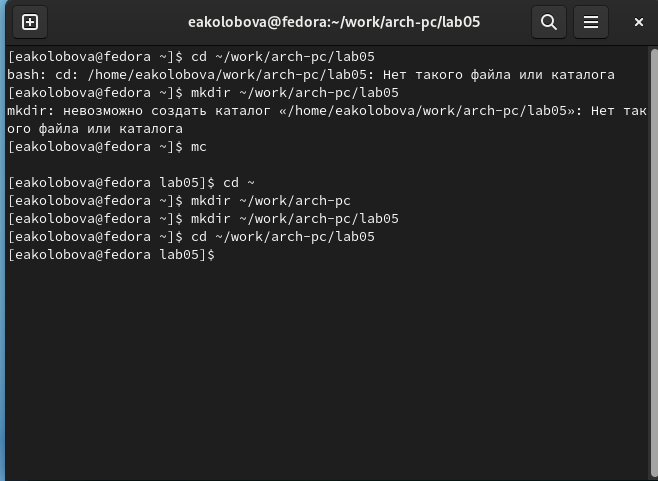{ #fig:001 width=70% }

2. Создаем текстовый файл с именем hello.asm (рис. 2)
> touch hello.asm
Открываем этот файл с помощью текстового редактора и вводим в него следующий текст (рис. 3):
> ; hello.asm
SECTION .data 			; Начало секции данных
hello: DB 'Hello world!',10 	; 'Hello world!' плюс
				; символ перевода строки
helloLen: EQU $-hello 		; Длина строки hello
SECTION .text 			; Начало секции кода
GLOBAL _start
_start: 			; Точка входа в программу
mov eax,4 			; Системный вызов для записи (sys_write)
mov ebx,1 			; Описатель файла '1' - стандартный вывод
mov ecx,hello 			; Адрес строки hello в ecx
mov edx,helloLen 		; Размер строки hello
int 80h 			; Вызов ядра
mov eax,1 			; Системный вызов для выхода (sys_exit)
mov ebx,0 			; Выход с кодом возврата '0' (без ошибок)
int 80h 			; Вызов ядра

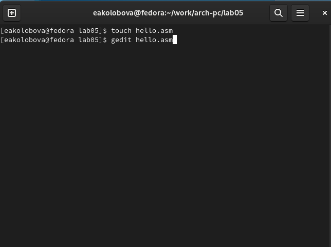{ #fig:001 width=70% }

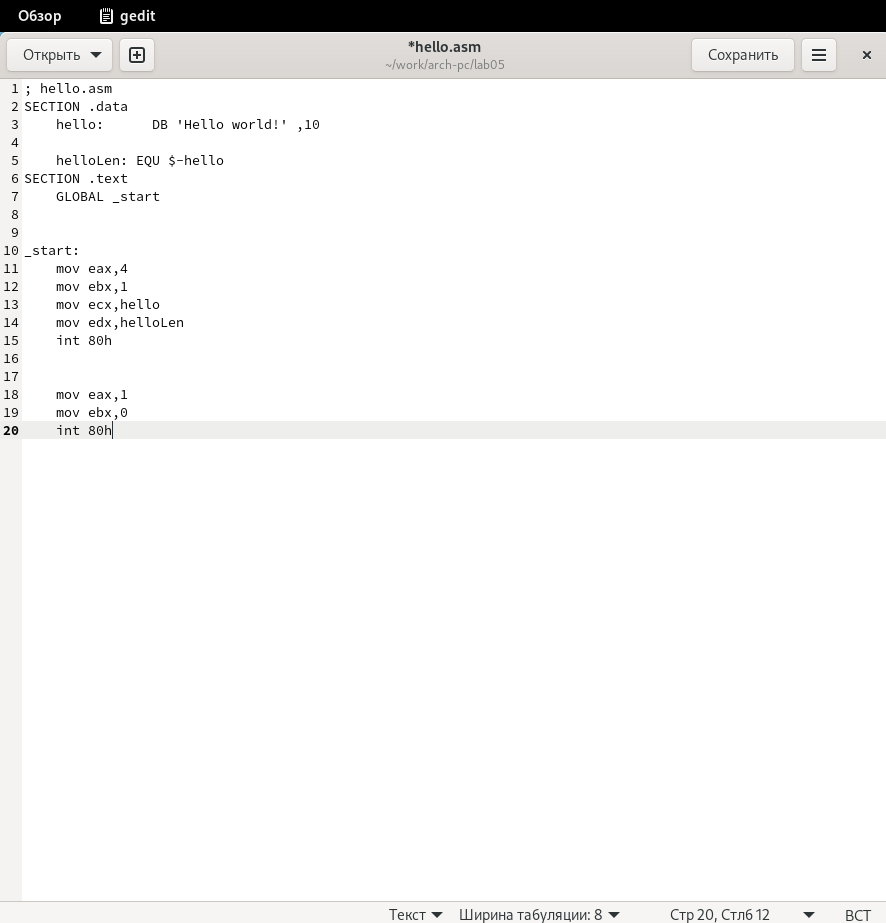{ #fig:001 width=70% }

3. для компиляции приведённого выше текста программы «Hello World» вводим команду (рис. 4):
> nasm -f elf hello.asm

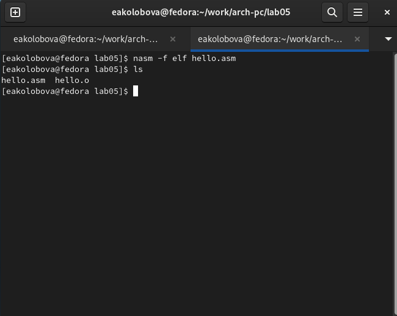{ #fig:001 width=70% }

4. Для компиляции исходного файла hello.asm в obj.o вводим команду (рис. 5):
> nasm -o obj.o -f elf -g -l list.lst hello.asm

С помощью команды ls проверяем, что файлы были создан (рис. 5)

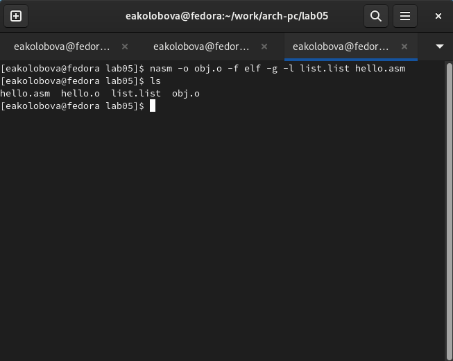{ #fig:001 width=70% }

5. Чтобы передать объектный файл на обработку компоновщику, вводим команду (рис. 6):
> ld -m elf_i386 hello.o -o hello

С помощью команды ls проверяем, что исполняемый файл hello был создан. (рис. 6)

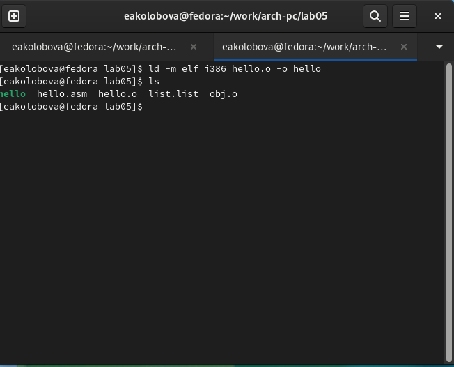{ #fig:001 width=70% }

6. Выполняем следующую команду (рис. 7):
> ld -m elf_i386 obj.o -o main
Исполняемый файл будет иметь имя main. Объектный файл из которого собран исполняемый файл имеет имя obj.o

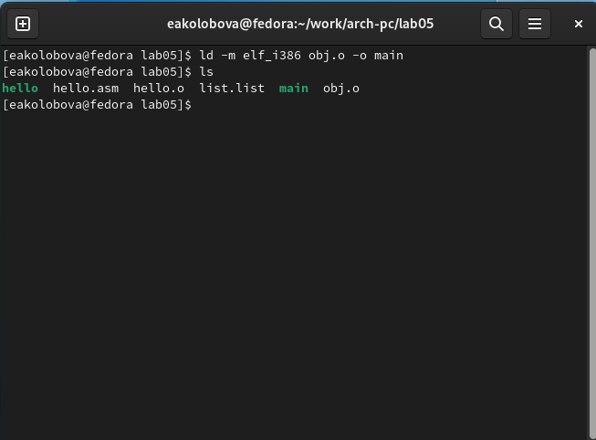{ #fig:001 width=70% }

7. Запускаем на выполнение созданный исполняемый файл, находящийся в текущем каталоге, набрав в командной строке (рис. 8):
> ./hello

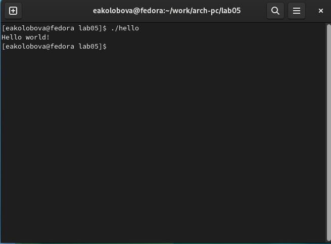{ #fig:001 width=70% }

## **Задание для самостоятельной работы**
1. В каталоге ~/work/arch-pc/lab05 с помощью команды cp создаем копию файла hello.asm с именем lab5.asm (рис. 9)

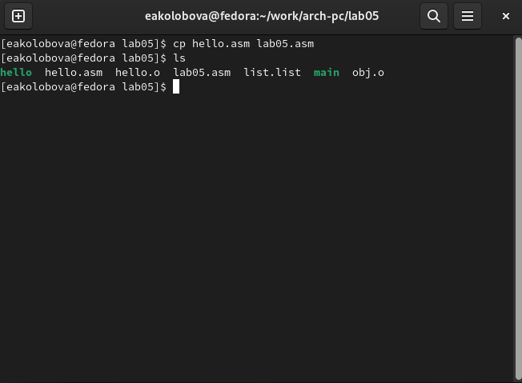{ #fig:001 width=70% }

2. С помощью текстового редактора вносим изменения в текст программы в файле lab5.asm так, чтобы вместо Hello world! на экран выводилась строка с фамилией и именем. (рис. 10, 11)

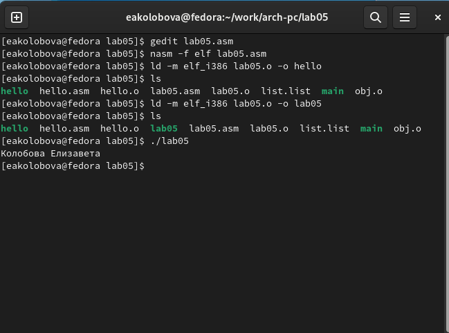{ #fig:001 width=70% }

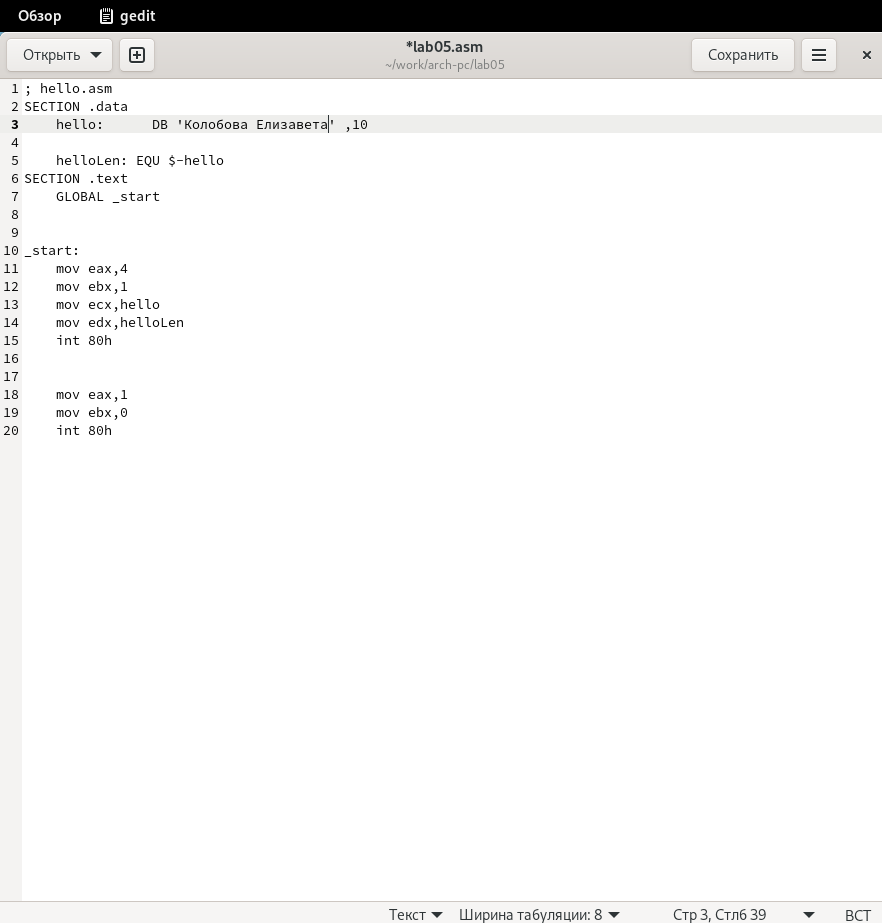{ #fig:001 width=70% }

3. Оттранслируем полученный текст программы lab5.asm в объектный файл. Выполняем компоновку объектного файла и запускаем получившийся исполняемый файл. (рис. 12)

4. Копируем файлы hello.asm и lab5.asm в локальный репозиторий в каталог ~/work/study/2022-2023/"Архитектура компьютера"/arch-pc/labs/lab05/.(рис. 12) Загружаем файлы на Github. (рис. 13)

> git add .
git commit -am 'feat(main): add files lab-4'
git push

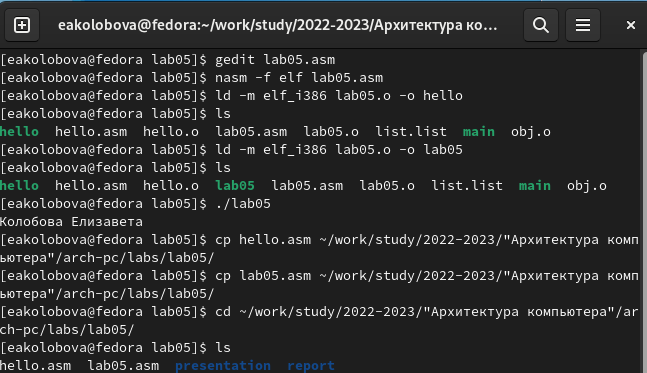{ #fig:001 width=70% }

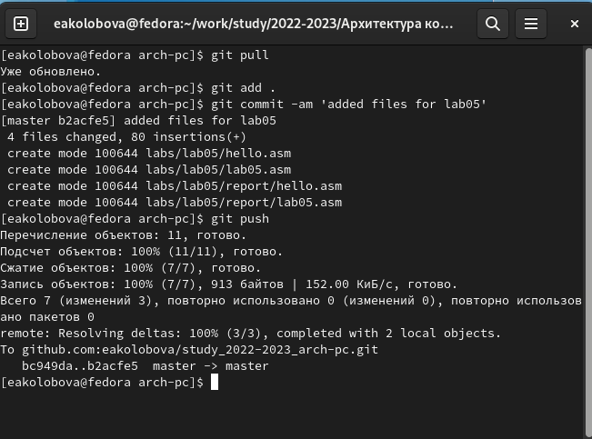{ #fig:001 width=70% }

Ссылка на репозиторий: https://github.com/eakolobova/study_2022-2023_arch-pc/tree/master/labs/lab05/report

# **Выводы**

Результатом проведенной работы является освоение процедуры компиляции и сборки программ, написанных на ассемблере NASM.

