---
## Front matter
title: "**Отчет по лабораторной работе №6**"
subtitle: "дисциплина: Архитектура компьютера"
author: "Колобова Елизавета Андреевна НММбд-01"

## Generic otions
lang: ru-RU
toc-title: "Содержание"

## Bibliography
bibliography: bib/cite.bib
csl: pandoc/csl/gost-r-7-0-5-2008-numeric.csl

## Pdf output format
toc: true # Table of contents
toc-depth: 2
lof: true # List of figures
lot: true # List of tables
fontsize: 12pt
linestretch: 1.5
papersize: a4
documentclass: scrreprt
## I18n polyglossia
polyglossia-lang:
  name: russian
  options:
	- spelling=modern
	- babelshorthands=true
polyglossia-otherlangs:
  name: english
## I18n babel
babel-lang: russian
babel-otherlangs: english
## Fonts
mainfont: PT Serif
romanfont: PT Serif
sansfont: PT Sans
monofont: PT Mono
mainfontoptions: Ligatures=TeX
romanfontoptions: Ligatures=TeX
sansfontoptions: Ligatures=TeX,Scale=MatchLowercase
monofontoptions: Scale=MatchLowercase,Scale=0.9
## Biblatex
biblatex: true
biblio-style: "gost-numeric"
biblatexoptions:
  - parentracker=true
  - backend=biber
  - hyperref=auto
  - language=auto
  - autolang=other*
  - citestyle=gost-numeric
## Pandoc-crossref LaTeX customization
figureTitle: "Рис."
tableTitle: "Таблица"
listingTitle: "Листинг"
lofTitle: "Список иллюстраций"
lotTitle: "Список таблиц"
lolTitle: "Листинги"
## Misc options
indent: true
header-includes:
  - \usepackage{indentfirst}
  - \usepackage{float} # keep figures where there are in the text
  - \floatplacement{figure}{H} # keep figures where there are in the text
---

# **Цель работы**

Целью работы является приобретение практических навыков работы в Midnight Commander, 
освоение инструкций языка ассемблера mov и int

# **Задание**

С помощью Midnight Commander создать на языке ассемблера программу вывода сообщения 
на экран и ввода строки с клавиатуры

# **Выполнение лабораторной работы**
1. Открываем Midnight Commander (рис. [-@fig:001])
```
user@dk4n31:~$ mc
```

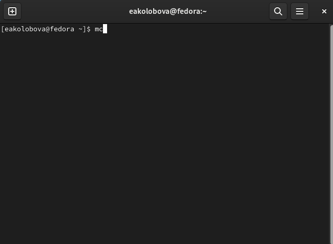{ #fig:001 width=70% }

2. Переходим в каталог ~/work/arch-
pc созданный при выполнении лабораторной работы No5 (рис. [-@fig:002]).

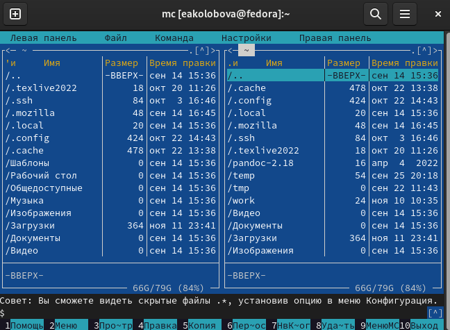{ #fig:002 width=70% }

3. С помощью функциональной клавиши F7 создаем папку lab06 (рис.[-@fig:003])
и переходим в созданный каталог

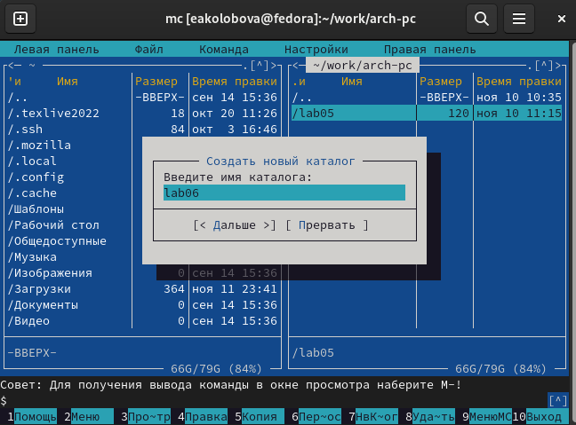{ #fig:003 width=70% }

4. Пользуясь строкой ввода и командой touch создаем файл lab6-1.asm (рис.[-@fig:004], [-@fig:005])

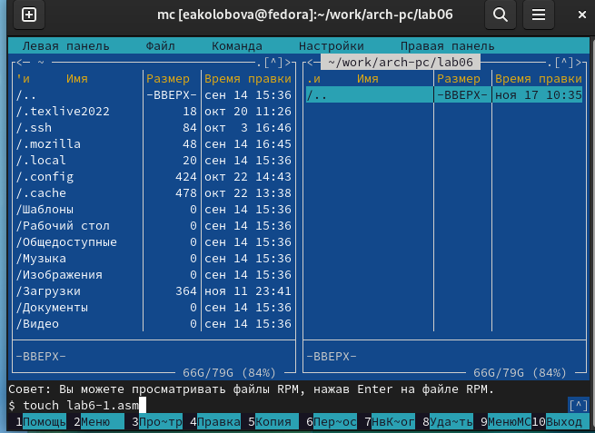{ #fig:004 width=70% }

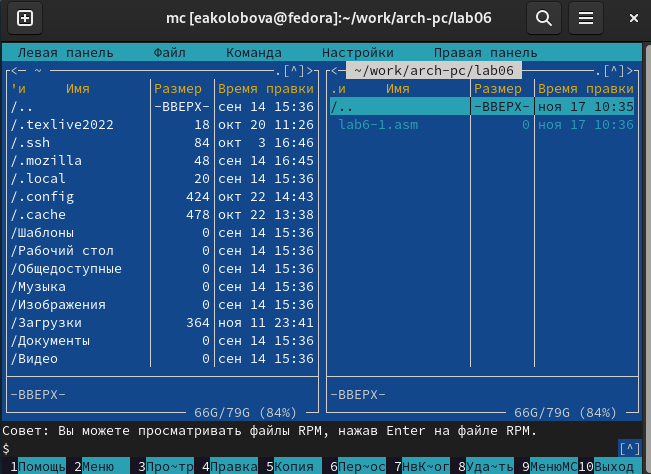{ #fig:005 width=70% }

5. С помощью функциональной клавиши F4 открываем файл lab6-1.asm для редактирования во встроенном редакторе. (рис. [-@fig:006], [-@fig:007], [-@fig:008])

6. Вводим текст программы из листинга 6.1, со-
храняем изменения и закрываем файл.(рис. [-@fig:006], [-@fig:007], [-@fig:008])

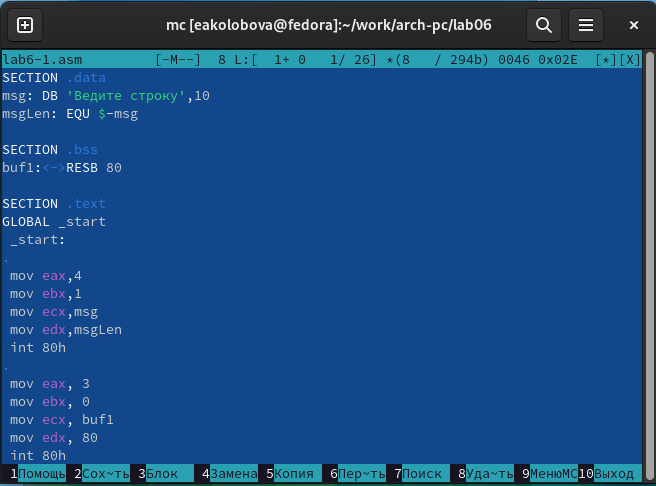{ #fig:006 width=70% }

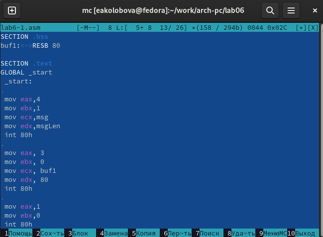{ #fig:007 width=70% }

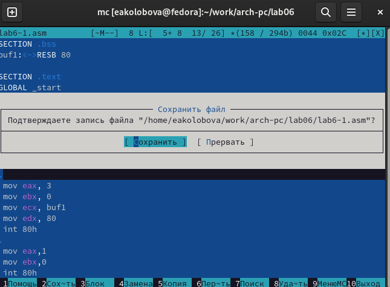{ #fig:008 width=70% }

7. С помощью функциональной клавиши F3 открываем файл lab6-1.asm для
просмотра. (рис. [-@fig:009])

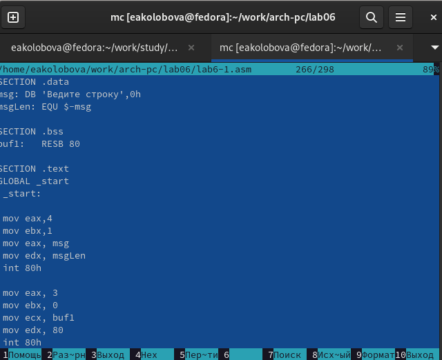{ #fig:009 width=70% }

8. Оттранслируем текст программы lab6-1.asm в объектный файл. Выполним
 компоновку объектного файла и запустим получившийся исполняемый
файл. Программа выводит строку 'Введите строку:' и ожидает ввода с
клавиатуры. На запрос вводим ФИО. (рис. [-@fig:010])
```
user@dk4n31:~$ nasm -f elf lab6-1.asm
user@dk4n31:~$ ld -m elf_i386 -o lab6-1 lab6-1.o
user@dk4n31:~$ ./lab6-1
Введите строку:
Имя пользователя
user@dk4n31:~$
```
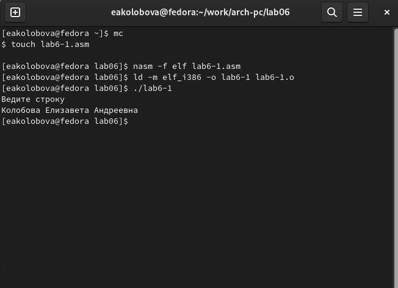{ #fig:010 width=70% }

9. Скачиваем файл in_out.asm со страницы курса в ТУИС.

10. В одной из панелей mc откроем каталог с файлом lab6-1.asm. В другой панели
каталог со скаченным файлом in_out.asm.
Скопируем файл in_out.asm в каталог с файлом lab6-1.asm
с помощью функциональной клавиши F5 (рис. [-@fig:011]).

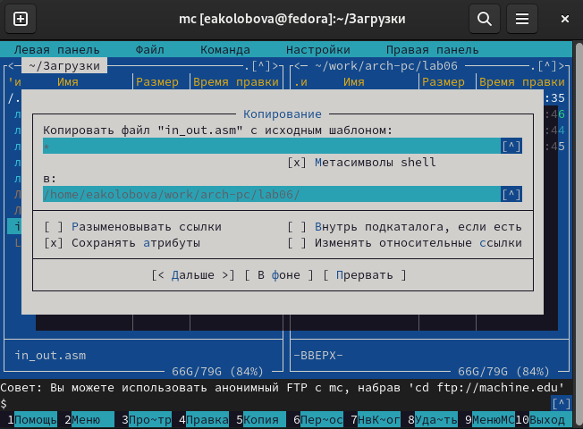{ #fig:011 width=70% }

11. С помощью функциональной клавиши F6 создаем копию файла lab6-
1.asm с именем lab6-2.asm. (рис. [-@fig:012]).

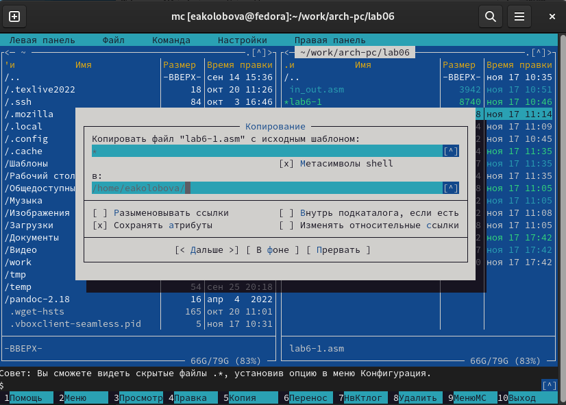{ #fig:012 width=70% }

12. Исправим текст программы в файле lab6-2.asm с использованием под-
программ из внешнего файла in_out.asm в соответствии с листингом 6.2. Создаем испол-
няемый файл и проверяем его работу. (рис. [-@fig:013], [-@fig:015])

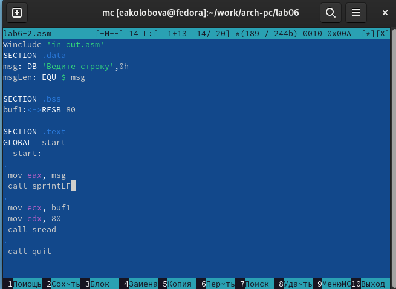{ #fig:013 width=70% }

13. В файле lab6-2.asm заменяем подпрограмму sprintLF на sprint. Создаем
исполняемый файл и проверяем его работу. (рис. [-@fig:014], [-@fig:015])

Программы различаются тем, что подпрограмма sprintLF сначала выводит приглашение на ввод
и считывает строку, введенную с клавиатуры, а sprint выводит заданную в программе строку.

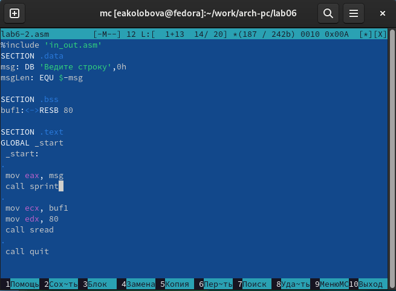{ #fig:014 width=70% }

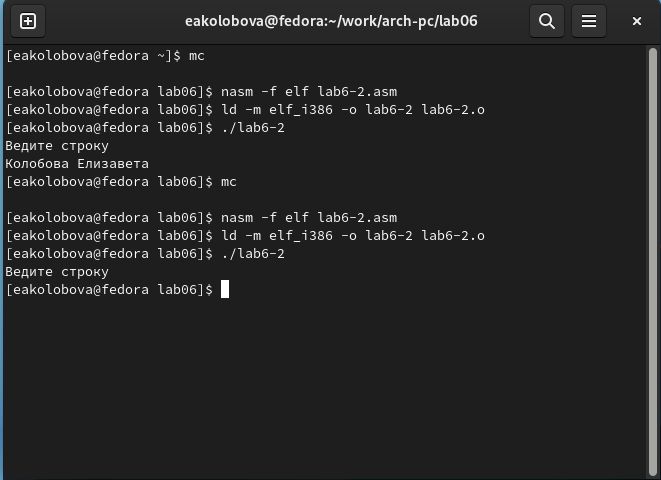{ #fig:015 width=70% }

## **Задание для самостоятельной работы**
1. Создайте копию файла lab6-1.asm. Внесите изменения в программу (без
использования внешнего файла in_out.asm), так чтобы она работала по
следующему алгоритму:
  1. вывести приглашение типа “Введите строку:”;
  2. ввести строку с клавиатуры;
  3. вывести введённую строку на экран
(рис. [-@fig:016])

Для этого вводим в текст программы перед командой завершения
```
mov eax, 4
mov ebx, 1 
mov ecx, buf1
int 80h 
```
 
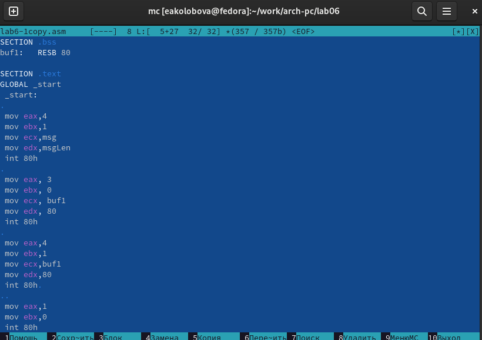{ #fig:016 width=70% }

2. Получите исполняемый файл и проверьте его работу. На приглашение
ввести строку введите свою фамилию. (рис. [-@fig:017])

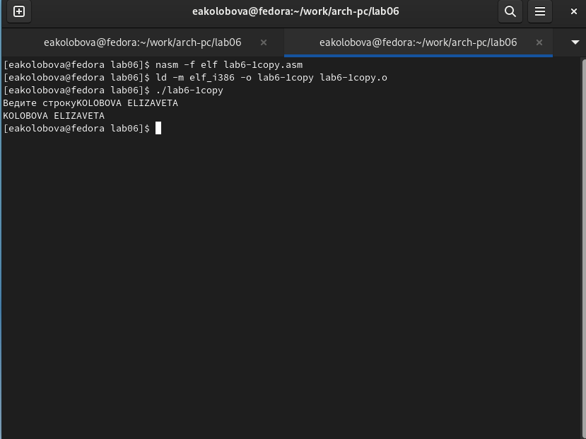{ #fig:017 width=70% }

3. Создайте копию файла lab6-2.asm. Исправьте текст программы с исполь-
зование подпрограмм из внешнего файла in_out.asm, так чтобы она ра-
ботала по следующему алгоритму:
  1. вывести приглашение типа “Введите строку:”;
  2. ввести строку с клавиатуры;
  3. вывести введённую строку на экран
(рис. [-@fig:018], [-@fig:019])

Для этого вводим в текст программы перед командой завершения
```
mov eax, 4
mov ebx, 80
call sprint
```
 
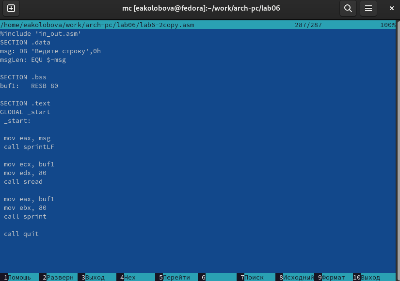{ #fig:018 width=70% }

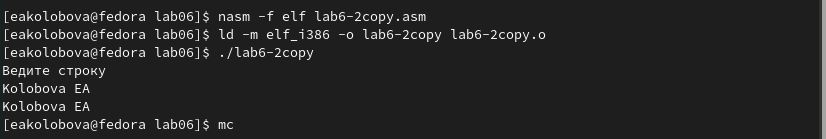{ #fig:019 width=70% }

Ссылка на репозиторий: https://github.com/eakolobova/study_2022-2023_arch-pc/tree/master/labs/lab06/report

# **Выводы**

Результатом проведенной работы является приобретение практических навыков работы в Midnight Commander, освоение инструкций языка ассемблера mov и int

