---
## Front matter
title: "**Отчет по лабораторной работе №7**"
subtitle: "дисциплина: Архитектура компьютера"
author: "Колобова Елизавета Андреевна гр. НММбд-01"

## Generic otions
lang: ru-RU
toc-title: "Содержание"

## Bibliography
bibliography: bib/cite.bib
csl: pandoc/csl/gost-r-7-0-5-2008-numeric.csl

## Pdf output format
toc: true # Table of contents
toc-depth: 2
lof: true # List of figures
lot: true # List of tables
fontsize: 12pt
linestretch: 1.5
papersize: a4
documentclass: scrreprt
## I18n polyglossia
polyglossia-lang:
  name: russian
  options:
	- spelling=modern
	- babelshorthands=true
polyglossia-otherlangs:
  name: english
## I18n babel
babel-lang: russian
babel-otherlangs: english
## Fonts
mainfont: PT Serif
romanfont: PT Serif
sansfont: PT Sans
monofont: PT Mono
mainfontoptions: Ligatures=TeX
romanfontoptions: Ligatures=TeX
sansfontoptions: Ligatures=TeX,Scale=MatchLowercase
monofontoptions: Scale=MatchLowercase,Scale=0.9
## Biblatex
biblatex: true
biblio-style: "gost-numeric"
biblatexoptions:
  - parentracker=true
  - backend=biber
  - hyperref=auto
  - language=auto
  - autolang=other*
  - citestyle=gost-numeric
## Pandoc-crossref LaTeX customization
figureTitle: "Рис."
tableTitle: "Таблица"
listingTitle: "Листинг"
lofTitle: "Список иллюстраций"
lotTitle: "Список таблиц"
lolTitle: "Листинги"
## Misc options
indent: true
header-includes:
  - \usepackage{indentfirst}
  - \usepackage{float} # keep figures where there are in the text
  - \floatplacement{figure}{H} # keep figures where there are in the text
---

# **Цель работы**

Целью работы является освоение арифметических инструкций языка ассемблера NASM.

# **Задание**

Написать на языке ассемблера программы вывода значения регистра и вычисления выражения. 

# **Выполнение лабораторной работы**
1. Создаем каталог для программам лабораторной работы No 7, переходим в
него и создаем файл lab7-1.asm (рис. [-@fig:001]):

```
mkdir ~/work/arch-pc/lab07
cd ~/work/arch-pc/lab07
touch lab7-1.asm
```

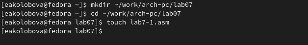{ #fig:001 width=70% }

2. Рассмотрим примеры программ вывода символьных и численных значе-
ний. Программы будут выводить значения записанные в регистр eax. Введедим в файл lab7-1.asm текст программы 
из листинга 7.1. (рис. [-@fig:002]).

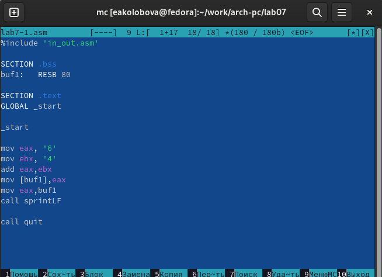{ #fig:002 width=70% }

3. Создаем исполняемый файл и запускаем его. (рис. [-@fig:003])

```
nasm -f elf lab7-1.asm
ld -m elf_i386 -o lab7-1 lab7-1.o
./lab7-1 (рис.[-@fig:003])
```

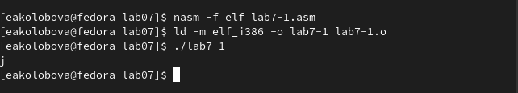{ #fig:003 width=70% }

4. Далее изменим текст программы и вместо символов, запишем в регистры числа. 
Исправим текст программы (Листинг 1) следующим образом (рис. [-@fig:004]):
заменим строки 

```
mov eax,'6'
mov ebx,'4'
```
на строки
```
mov eax,6
mov ebx,4
```
Создаем исполняемый файл и запускаем его.
(рис. [-@fig:005])

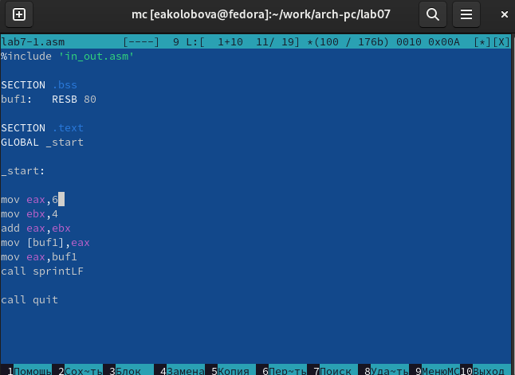{ #fig:004 width=70% }

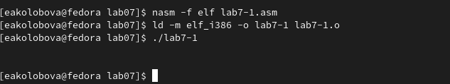{ #fig:005 width=70% }

5. Создаем файл lab7-2.asm в каталоге ~/work/arch-pc/lab07 

```
touch ~/work/arch-pc/lab07/lab7-2.asm.
```
и вводим в него текст программы из листинга 7.2.
Создаем исполняемый файл и запускаем его.

```
nasm -f elf lab7-1.asm
ld -m elf_i386 -o lab7-1 lab7-1.o
./lab7-1
```
(рис. [-@fig:006], [-@fig:007])


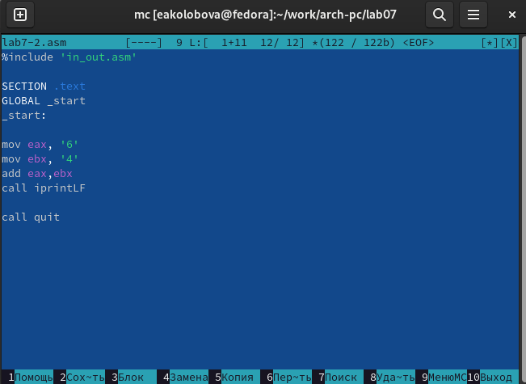{ #fig:006 width=70% }

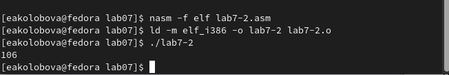{ #fig:007 width=70% }

6. Заменим строки

```
mov eax,'6'
mov ebx,'4'
```
на строки

```
mov eax,6
mov ebx,4
```

Создаем исполняемый файл и запускаем его. (рис. [-@fig:008], [-@fig:009])
При исполнении программы получен результат 10, т.е. результат сложения 6+4

Заменим функцию iprintLF на iprint. Создаем исполняемый файл и запускаем его. 
Вывод функций iprintLF отличается от iprint наличием перевода строки.(рис. [-@fig:0010], [-@fig:0011])

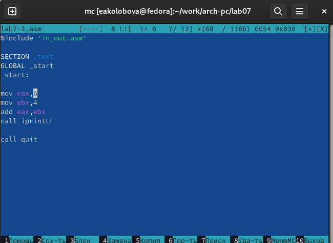{ #fig:008 width=70% }

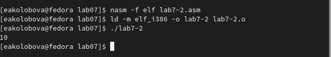{ #fig:009 width=70% }

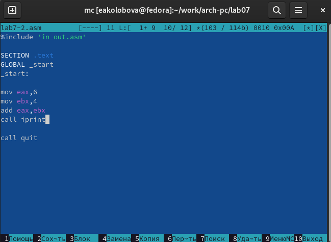{ #fig:0010 width=70% }

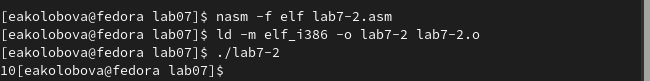{ #fig:0011 width=70% }

7. Рассмотрим программу вычисления арифметического выражения 
f(x) = (5 * 2 + 3)/3. 

Создаем файл lab7-3.asm в каталоге ~/work/arch-pc/lab07:

```touch ~/work/arch-pc/lab07/lab7-3.asm
```

Вводим текст программы из листинга 7.3 в lab7-3.asm 
Создаем исполняемый файл и запускаем его. Результат работы программы
должен быть следующим:

```
user@dk4n31:~$ ./lab7-3
Результат: 4
Остаток от деления: 1
user@dk4n31:~$
```
Как видно по рис. [-@fig:0014], полученный результат совпадает с требуемым.(рис. [-@fig:0012], [-@fig:0013], [-@fig:0014])

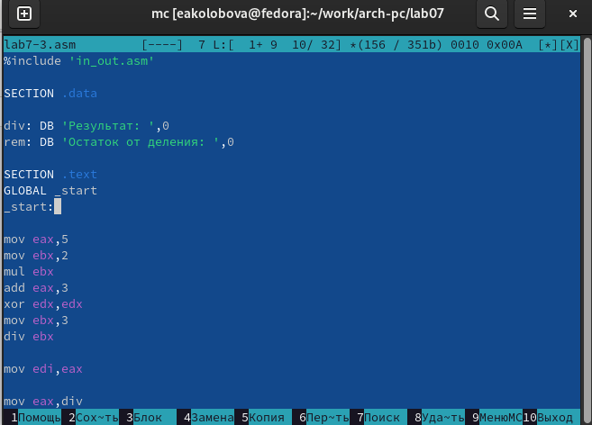{ #fig:0012 width=70% }

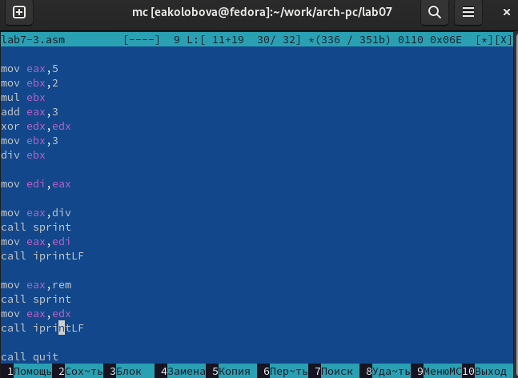{ #fig:0013 width=70% }

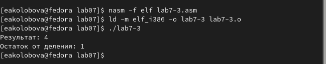{ #fig:0014 width=70% }

8. Изменим текст программы для вычисления выражения f(x) = (4 * 6 + 2)/5.
Создаем исполняемый файл и проверяем его работу. (рис. [-@fig:0015], [-@fig:0016])

```
user@dk4n31:~$ nasm -f elf lab6-1.asm
user@dk4n31:~$ ld -m elf_i386 -o lab6-1 lab6-1.o
user@dk4n31:~$ ./lab6-1
Введите строку:
Имя пользователя
user@dk4n31:~$
```
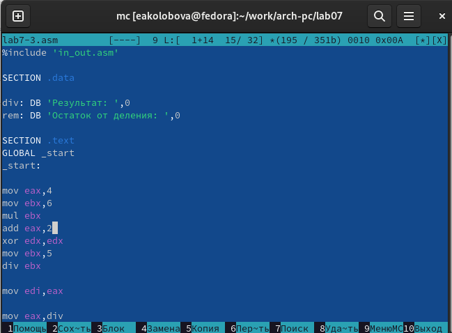{ #fig:0015 width=70% }

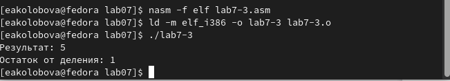{ #fig:0016 width=70% }

9. Рассмотрим программу вычисления варианта
задания по номеру студенческого билета, работающую по следующему
алгоритму:
  1. вывести запрос на введение  студенческого билета
  2. вычислить номер варианта по формуле: (Sn mod 20) + 1, где Sn –
номер студенческого билета (В данном случае a mod b – это остаток
от деления a на b).
  3. вывести на экран номер вариант
Создаем файл variant.asm в каталоге ~/work/arch-pc/lab07:
```touch ~/work/arch-pc/lab07/variant.asm
```
Вводим текст программы из листинга 7.4 в файл variant.asm. 
Создаем исполняемый файл и запускаем его. 
Проверяем результат работы. (рис. [-@fig:0017], [-@fig:0018], [-@fig:0019])

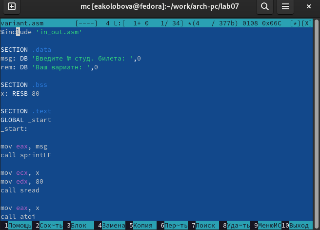{ #fig:0017 width=70% }

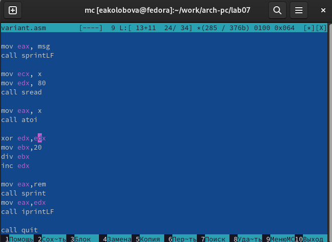{ #fig:0018 width=70% }

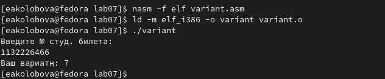{ #fig:0019 width=70% }

10. Вопросы:
  1. Какие строки листинга 7.4 отвечают за вывод на экран сообщения ‘Ваш
    вариант:’? -
    
```
    mov eax,rem
    call sprint
```
  2. Для чего используется следующие инструкции? nasm mov ecx, x
  mov edx, 80 call sread -
  для считывания введенного с клавиатуры значения х
  
  3. Для чего используется инструкция “call atoi”? -
  для преобразования ASCII кода в число, `eax=x`
  
  4. Какие строки листинга 7.4 отвечают за вычисления варианта? -
 
``` 
   mov ebx,20
   div ebx
   inc edx
```
  5. В какой регистр записывается остаток от деления при выполнении инструкции 
  “div ebx”? -
   в edx
   
  6. Для чего используется инструкция “inc edx”? -
  для увеличения значения регистра edx на 1
  
  7. Какие строки листинга 7.4 отвечают за вывод на экран результата вычислений? -
  
``` 
   mov eax,edx
   call iprintLF 
```

## **Задание для самостоятельной работы**
1. Написать программу вычисления выражения y = f(x). Программа должна
выводить выражение для вычисления, выводить запрос на ввод значения
x, вычислять заданное выражение в зависимости от введенного x, выво-
дить результат вычислений. Вид функции f(x) выбрать из таблицы 7.3
вариантов заданий в соответствии с номером полученным при выполне-
нии лабораторной работы. Создайте исполняемый файл и проверьте его
работу для значений x1 и x2 из 7.3

Из программы (рис. [-@fig:0019]), получаем, что номеру студ.билета соответствует вариант 7
Выражение :5*(x − 1)^2, х1=3,  х2=5
Для получения нужной программы вводим текст, представленный на рис. [-@fig:0020], [-@fig:0021]
Создаем исполняемый файл и запускаем его. 
Проверяем результат работы на значениях х1 и х2. (рис. [-@fig:0022]
 
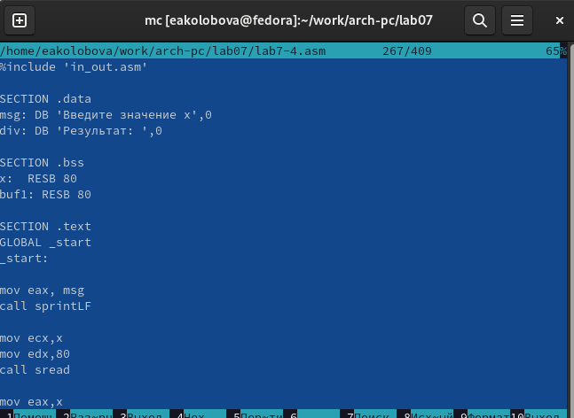{ #fig:0020 width=70% }

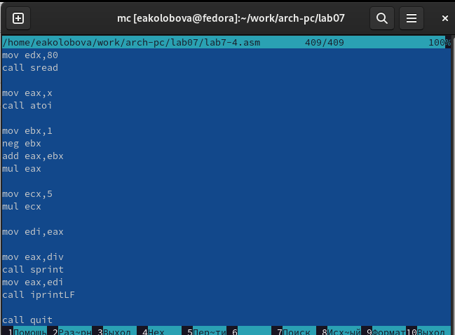{ #fig:0021 width=70% }

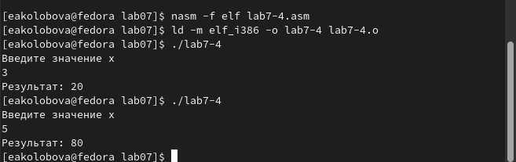{ #fig:0022 width=70% }


Ссылка на репозиторий: https://github.com/eakolobova/study_2022-2023_arch-pc/tree/master/labs/lab07/report

# **Выводы**

Результатом проведенной работы является освоение арифметических инструкций языка ассемблера NASM.
