---
## Front matter
title: "**Отчет по лабораторной работе №8**"
subtitle: "дисциплина: Архитектура компьютера"
author: "Колобова Елизавета Андреевна гр. НММбд-01"

## Generic otions
lang: ru-RU
toc-title: "Содержание"

## Bibliography
bibliography: bib/cite.bib
csl: pandoc/csl/gost-r-7-0-5-2008-numeric.csl

## Pdf output format
toc: true # Table of contents
toc-depth: 2
lof: true # List of figures
lot: true # List of tables
fontsize: 12pt
linestretch: 1.5
papersize: a4
documentclass: scrreprt
## I18n polyglossia
polyglossia-lang:
  name: russian
  options:
	- spelling=modern
	- babelshorthands=true
polyglossia-otherlangs:
  name: english
## I18n babel
babel-lang: russian
babel-otherlangs: english
## Fonts
mainfont: PT Serif
romanfont: PT Serif
sansfont: PT Sans
monofont: PT Mono
mainfontoptions: Ligatures=TeX
romanfontoptions: Ligatures=TeX
sansfontoptions: Ligatures=TeX,Scale=MatchLowercase
monofontoptions: Scale=MatchLowercase,Scale=0.9
## Biblatex
biblatex: true
biblio-style: "gost-numeric"
biblatexoptions:
  - parentracker=true
  - backend=biber
  - hyperref=auto
  - language=auto
  - autolang=other*
  - citestyle=gost-numeric
## Pandoc-crossref LaTeX customization
figureTitle: "Рис."
tableTitle: "Таблица"
listingTitle: "Листинг"
lofTitle: "Список иллюстраций"
lotTitle: "Список таблиц"
lolTitle: "Листинги"
## Misc options
indent: true
header-includes:
  - \usepackage{indentfirst}
  - \usepackage{float} # keep figures where there are in the text
  - \floatplacement{figure}{H} # keep figures where there are in the text
---

# **Цель работы**

Целью работы является изучение команд условного и безусловного переходов. Приобретение навы-
ков написания программ с использованием переходов. Знакомство с назначе-
нием и структурой файла листинга.


# **Выполнение лабораторной работы**
1. Создаем каталог для программам лабораторной работы No 8, переходим в
него и создаем файл lab8-1.asm (рис. [-@fig:001]):

```
mkdir ~/work/arch-pc/lab08
cd ~/work/arch-pc/lab08
touch lab8-1.asm
```

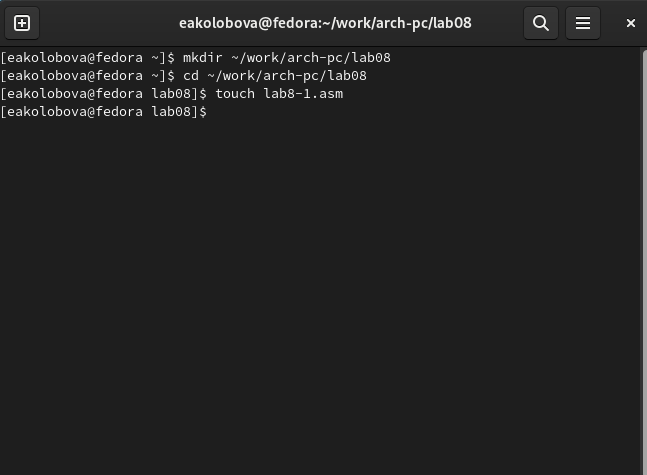{ #fig:001 width=70% }

2. Рассмотрим пример программы с использованием инструкции jmp.
Введем в файл lab8-1.asm текст программы из листинга 8.1. (рис. [-@fig:002]).

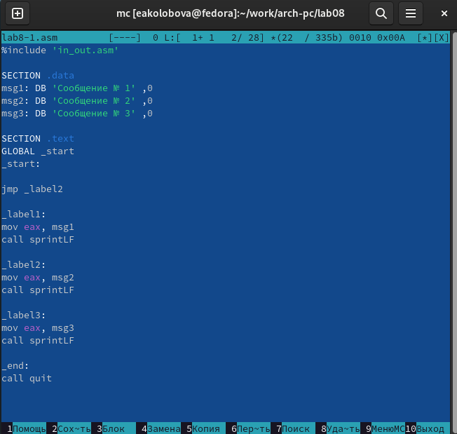{ #fig:002 width=70% }

3. Создаем исполняемый файл и запускаем его. (рис. [-@fig:003])

```
nasm -f elf lab8-1.asm
ld -m elf_i386 -o lab8-1 lab7-8.o
./lab8-1 
```
Ожидаемый результат:
```
user@dk4n31:~$ ./lab8-1
Сообщение No 2
Сообщение No 3
user@dk4n31:~$
```
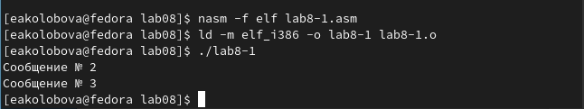{ #fig:003 width=70% }

4. Далее изменим текст программы таким образом, чтобы она выводила сначала
‘Сообщение No 2’, потом ‘Сообщение No 1’ и завершала работу. Для этого в
текст программы после вывода сообщения No 2 добавим инструкцию jmp с
меткой _label1 и после вывода сообщения No 1 добавим инструкцию jmp с меткой _end 
Изменим текст программы в соответствии с листингом 8.2 и вместо символов, 
запишем в регистры числа. (рис. [-@fig:004]):

Создаем исполняемый файл и запускаем его.
(рис. [-@fig:005])

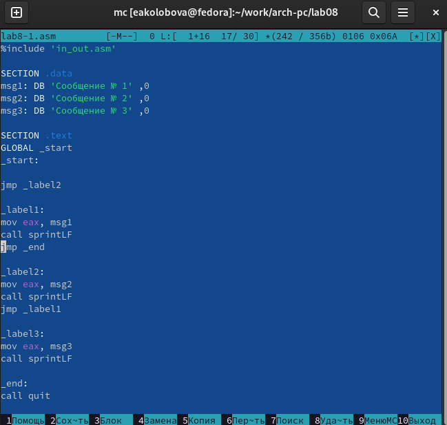{ #fig:004 width=70% }

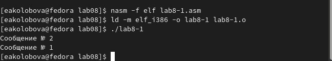{ #fig:005 width=70% }

5. Рассмотрим программу, которая определяети выводит на экран наибольшую
из 3 целочисленных переменных: A,B и C. Значения для A и C задаются в программе,
значение B вводится с клавиатуры.
Создаем файл lab8-2.asm в каталоге ~/work/arch-pc/lab08. и вводим в него текст программы из листинга 8.3.
(рис. [-@fig:006], [-@fig:007], [-@fig:008])


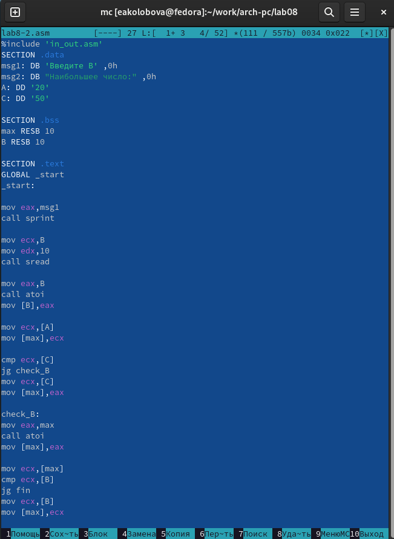{ #fig:006 width=70% }

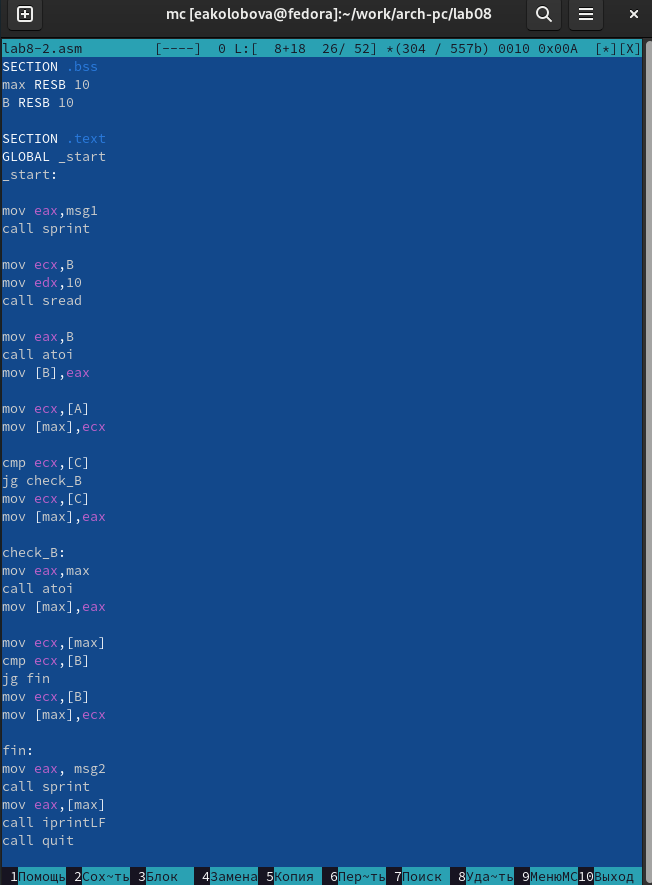{ #fig:007 width=70% }

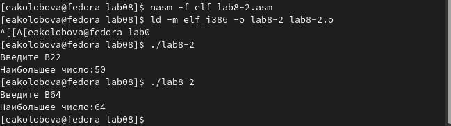{ #fig:008 width=70% }

6. Создадим файл листинга для программы из файла lab8-2.asm (рис. [-@fig:009])
```
nasm -f elf -l lab8-2.lst lab8-2.asm
```
Откроем файл листинга lab8-2.lst с помощью любого текстового редактора:
```
mcedit lab8-2.lst
```

(рис. [-@fig:0010], [-@fig:0011], [-@fig:0012], [-@fig:0013])

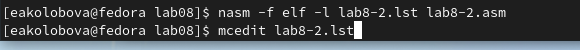{ #fig:009 width=70% }

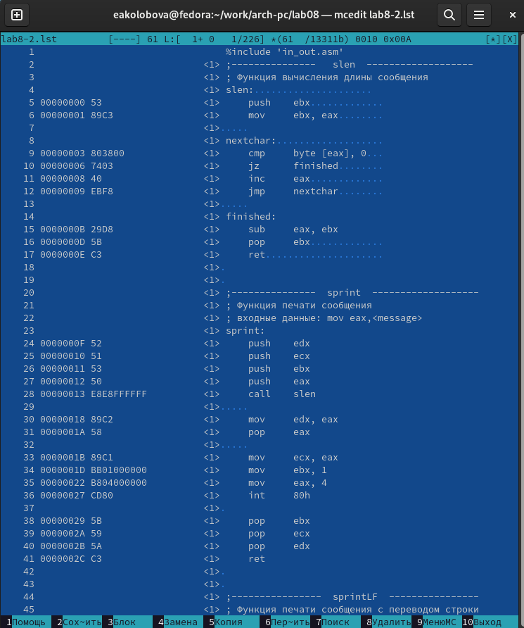{ #fig:0010 width=70% }

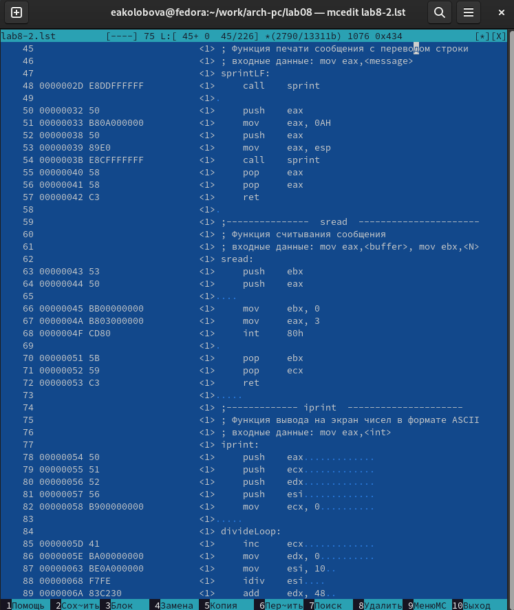{ #fig:0011 width=70% }

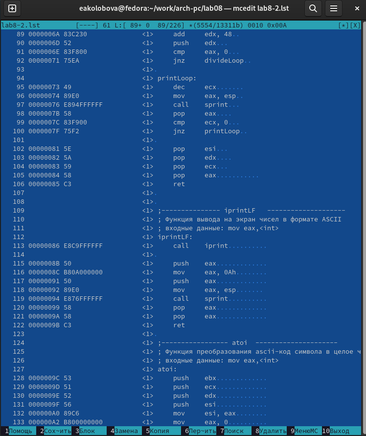{ #fig:0012 width=70% }

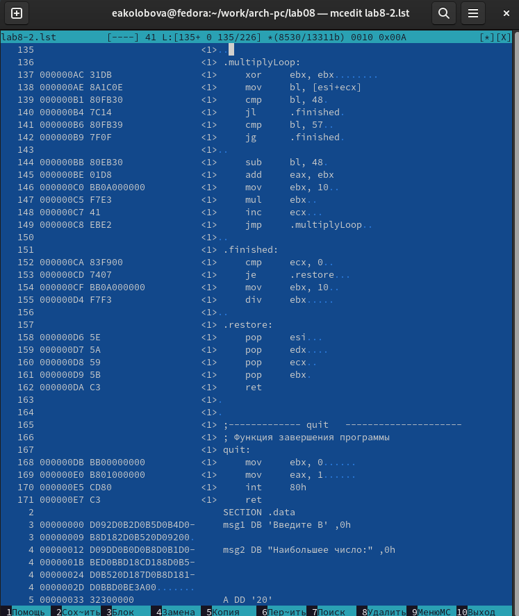{ #fig:0013 width=70% }

7. Подробно объясним содержимое трёх строк файла листинга 19, 20, 21, представленных на рис. [-@fig:0014] :
19, 20 и 21 - номера соотв. строк
000000F2, 000000F7, 000000FC - адреса
B9(0A000000], BA0A000000, E842FFFFFF - машинные кода, ассемблированые исходные строки 
в виде шестнадцатеричных последовательностей
mov ecx,B; mov edx,10; call sread - исходный текст программы

{ #fig:0014 width=70% }

8. Откройем файл с программой lab8-2.asm и в выделенной на рис. инструкции с двумя
операндами удалим один операнд. Выполните трансляцию с получением файла
листинга, (рис. [-@fig:0015], [-@fig:0016]):
```
nasm -f elf -l lab8-2.lst lab8-2.asm
```
В данном случае файлы не создаются, а в терминале выводится ошибка - рис. [-@fig:0017]

{ #fig:0015 width=70% }

{ #fig:0016 width=70% }

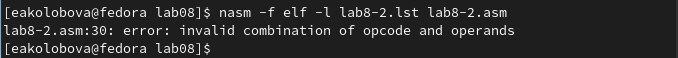{ #fig:0017 width=70% }


## **Задание для самостоятельной работы**
В ходе выполнения работы № 7 был получен вариант 7, 
соответствующие значения: 45, 67, 15 в табл. 8.5
выражение в табл. 8.6: f(x) = 6a, x=a; x+a, x=/=a; (x1,a1)=(1,1), (x2,a2)=(2,1)

1. Написать программу нахождения наименьшей из 3 целочисленных пере-
менных a = 45,b = 67 и c = 15. (рис. [-@fig:0018], [-@fig:0019])
 
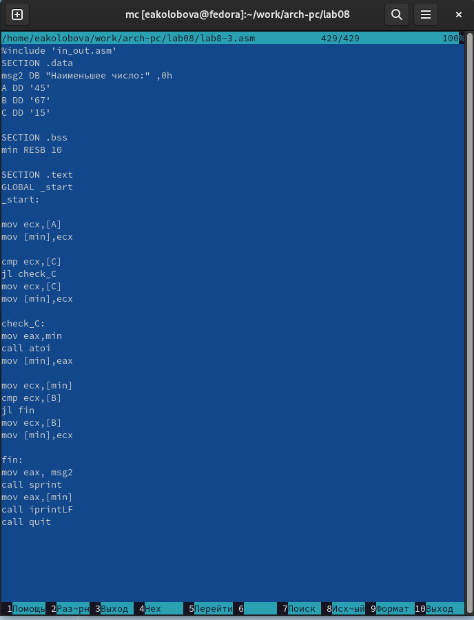{ #fig:0018 width=70% }

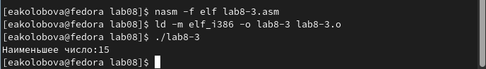{ #fig:0019 width=70% }

2. Написать программу, которая для введенных с клавиатуры значений x
и a вычисляет значение заданной функции f(x) = 6a, x=a; x+a, x=/=a; и выводит результат вычислений. 
(рис. [-@fig:0020], [-@fig:0021], [-@fig:0022])

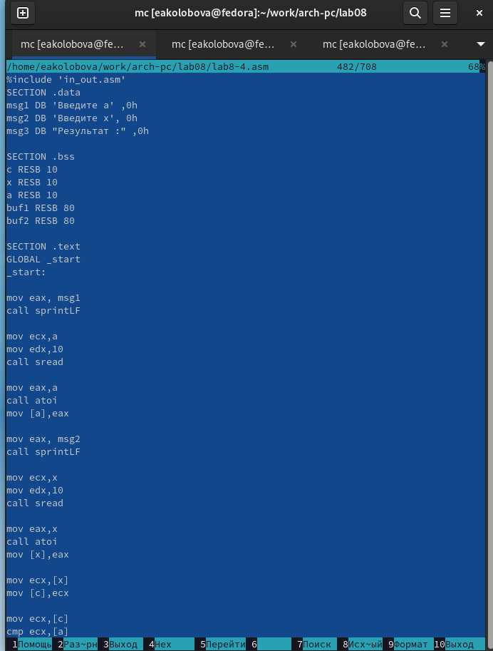{ #fig:0020 width=70% }

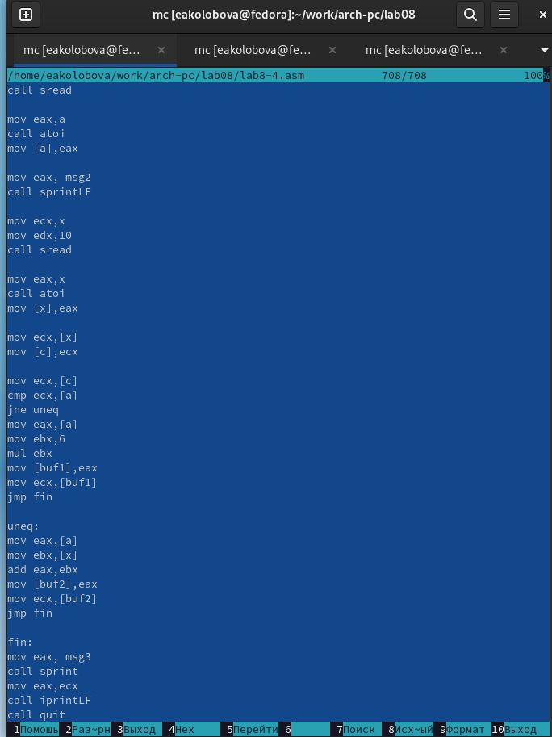{ #fig:0021 width=70% }

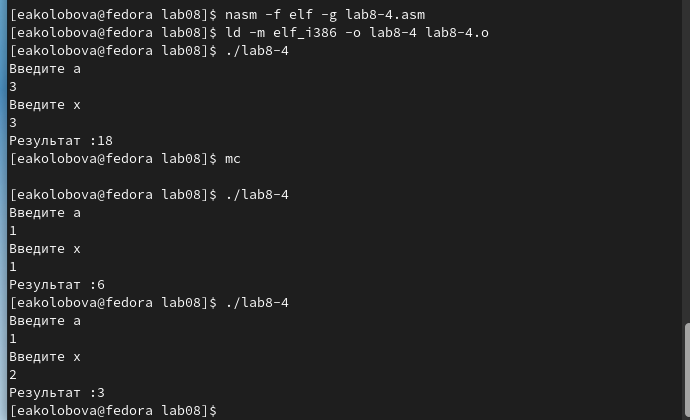{ #fig:0022 width=70% }

Ссылка на репозиторий: https://github.com/eakolobova/study_2022-2023_arch-pc/tree/master/labs/lab08/report

# **Выводы**

Результатом проведенной работы является освоение команд условного и безусловного переходов и приобретение навыков написания программ с использованием переходов. Знакомство с назначением и структурой файла листинга.
