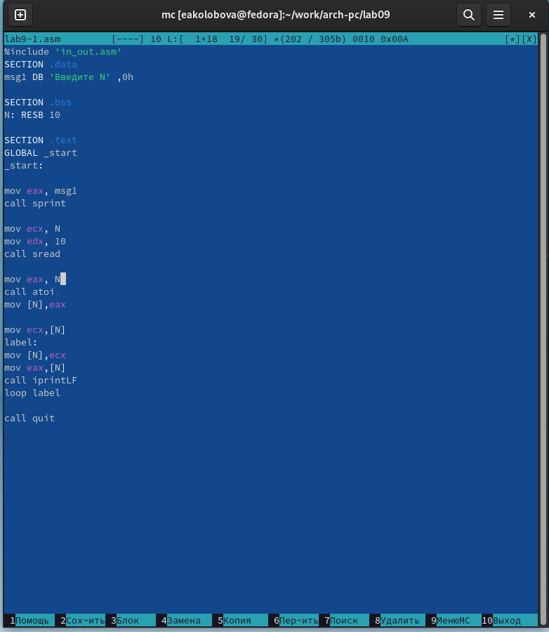
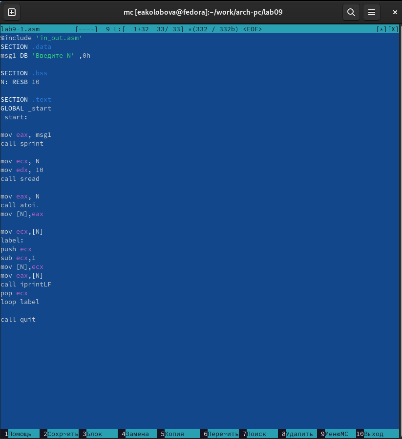
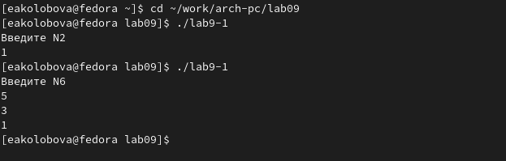
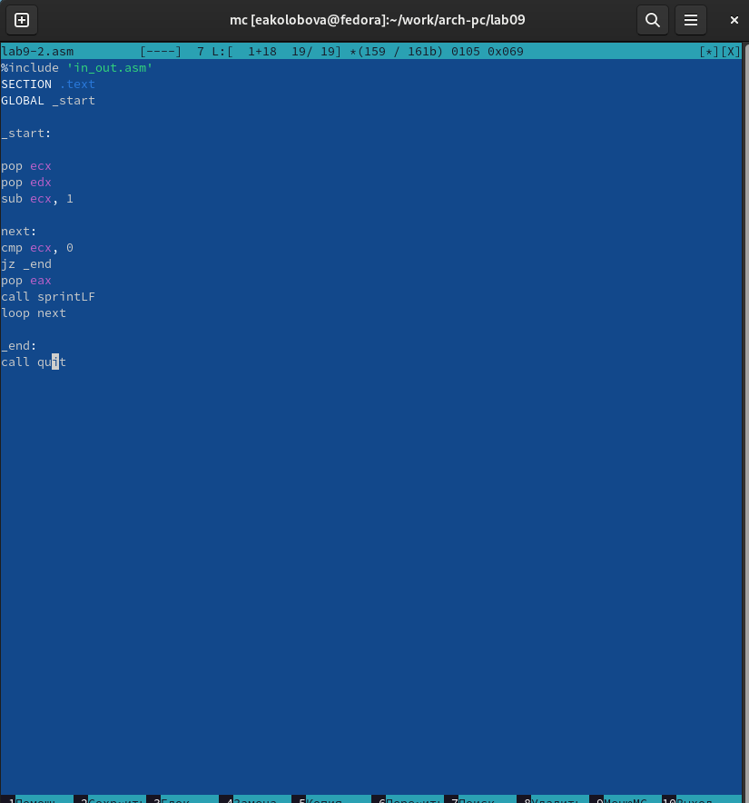
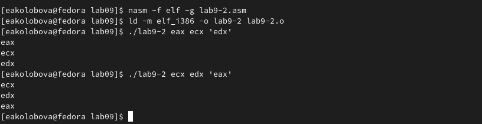
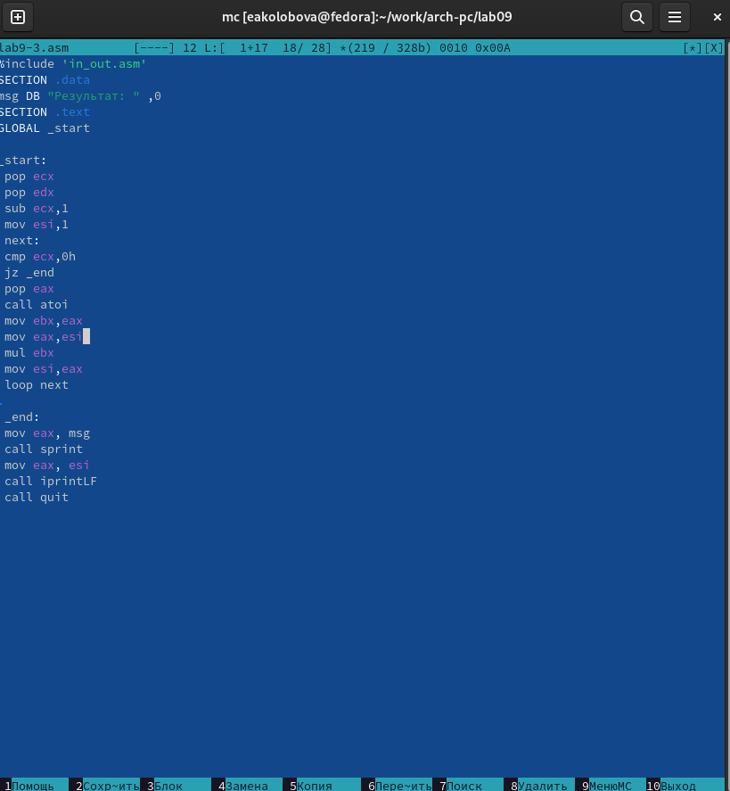
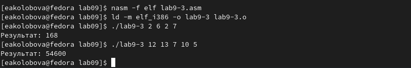
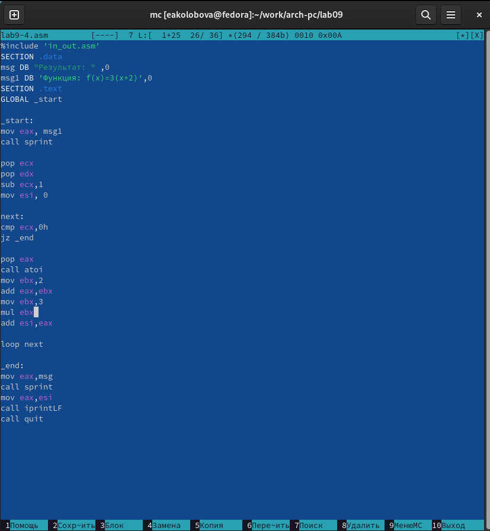
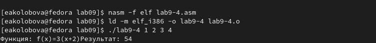
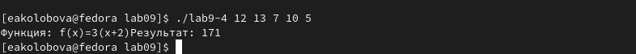

---
## Front matter
title: "**Отчет по лабораторной работе №9**"
subtitle: "дисциплина: Архитектура компьютера"
author: "Колобова Елизавета Андреевна гр. НММбд-01"

## Generic otions
lang: ru-RU
toc-title: "Содержание"

## Bibliography
bibliography: bib/cite.bib
csl: pandoc/csl/gost-r-7-0-5-2008-numeric.csl

## Pdf output format
toc: true # Table of contents
toc-depth: 2
lof: true # List of figures
lot: true # List of tables
fontsize: 12pt
linestretch: 1.5
papersize: a4
documentclass: scrreprt
## I18n polyglossia
polyglossia-lang:
  name: russian
  options:
	- spelling=modern
	- babelshorthands=true
polyglossia-otherlangs:
  name: english
## I18n babel
babel-lang: russian
babel-otherlangs: english
## Fonts
mainfont: PT Serif
romanfont: PT Serif
sansfont: PT Sans
monofont: PT Mono
mainfontoptions: Ligatures=TeX
romanfontoptions: Ligatures=TeX
sansfontoptions: Ligatures=TeX,Scale=MatchLowercase
monofontoptions: Scale=MatchLowercase,Scale=0.9
## Biblatex
biblatex: true
biblio-style: "gost-numeric"
biblatexoptions:
  - parentracker=true
  - backend=biber
  - hyperref=auto
  - language=auto
  - autolang=other*
  - citestyle=gost-numeric
## Pandoc-crossref LaTeX customization
figureTitle: "Рис."
tableTitle: "Таблица"
listingTitle: "Листинг"
lofTitle: "Список иллюстраций"
lotTitle: "Список таблиц"
lolTitle: "Листинги"
## Misc options
indent: true
header-includes:
  - \usepackage{indentfirst}
  - \usepackage{float} # keep figures where there are in the text
  - \floatplacement{figure}{H} # keep figures where there are in the text
---

# **Цель работы**

Целью работы является приобретение навыков написания программ с использованием циклов и
обработкой аргументов командной строки.


# **Выполнение лабораторной работы**
1. Создадим каталог для программам лабораторной работы No 9, перейдем в
него и создадим файл lab9-1.asm (рис. [-@fig:001]):
```
mkdir ~/work/arch-pc/lab09
cd ~/work/arch-pc/lab09
touch lab9-1.asm 
```

{ #fig:001 width=70% }

2. Рассмотрим программу, которая выводит значение регистра ecx.
Введем в файл lab9-1.asm текст программы из листинга 9.1. Создадим исполняемый
файл и проверим его работу (рис. [-@fig:002]), (рис. [-@fig:003]).

{ #fig:002 width=70% }

{ #fig:003 width=70% }

Данный пример показывает, что использование регистра ecx в теле цилка
loop может привести к некорректной работе программы.

3. Изменим текст программы,
добавив изменение значения регистра ecx в цикле (рис. [-@fig:004], [-@fig:005]):
```
label:
sub ecx,1 
mov [N],ecx
mov eax,[N]
call iprintLF
loop label 5
```
Создадим исполняемый файл и проверим его работу. Регистр ecx в цикле принимает в первом подходе введенное значение, уменьшенное на 1, в каждом следующем - уменьшенное на 2. Число проходов цикла не соответствует значению N, введенному с клавиатуры.

{ #fig:004 width=70% }

{ #fig:005 width=70% }

4. Внесем изменения в текст программы,
добавив команды push и pop (добавления в стек и извлечения из стека) для
сохранения значения счетчика цикла loop: (рис. [-@fig:006]):
```
label:
push ecx 
sub ecx,1
mov [N],ecx
mov eax,[N]
call iprintLF
pop ecx 
loop label
```
Создадим исполняемый файл и проверим его работу. Соответствует ли в данном
случае число проходов цикла значению N введенному с клавиатур (рис. [-@fig:007])

{ #fig:006 width=70% }

{ #fig:007 width=70% }


5. Рассмотрим программу, которая выводит на экран аргументы командной строки. 
Создадим файл lab9-2.asm в каталоге ~/work/arch-pc/lab09 и введем в него
текст программы из листинга 9.2.
Создадим исполняемый файл и запустим его, указав аргументы:
```
user@dk4n31:~$ ./lab9-2 аргумент1 аргумент 2 'аргумент 3'
```
Сколько аргументов было обработано программой?(рис. [-@fig:008], [-@fig:009]):

{ #fig:008 width=70% }

{ #fig:009 width=70% }


6. Рассмотрим еще один пример программы которая выводит сумму чисел,
которые передаются в программу как аргументы. Создадим файл lab9-3.asm в
каталоге ~/work/arch-pc/lab09 и введем в него текст программы из листинга
9.3
Создадим исполняемый файл и запустим его, указав аргументы. Пример
результата работы программы:
```
user@dk4n31:~$ ./main 12 13 7 10 5
Результат: 47
user@dk4n31:~$
```
(рис. [-@fig:0010], [-@fig:0011])

{ #fig:0010 width=70% }

{ #fig:0011 width=70% }

7. Изменим текст программы из листинга 9.3 для вычисления произведения
аргументов командной строки. (рис. [-@fig:0012], [-@fig:0013])

{ #fig:0012 width=70% }

{ #fig:0013 width=70% }

## **Задание для самостоятельной работы**
В ходе выполнения работы № 7 был получен вариант 7, 
выражение в табл. 9.4: f(x) = 6a, 

1. Написать программу, которая находит сумму значений функции f(x)
для x = x1, x2, ..., xn, т.е. программа должна выводить значение f(x1)+
f(x2)+..+f(xn). Значения xi передаются как аргументы. Вид функции f(x)
выбрать из таблицы 9.4 вариантов заданий в соответствии с вариантом, по-
лученным при выполнении лабораторной работы No 7. Создайте исполня-
емый файл и проверьте его работу на нескольких наборах x = x1, x2,.., xn 
(рис. [-@fig:0014], [-@fig:0015], [-@fig:0016])
 
{ #fig:0014 width=70% }

{ #fig:0015 width=70% }

{ #fig:0016 width=70% }

Ссылка на репозиторий: https://github.com/eakolobova/study_2022-2023_arch-pc/tree/master/labs/lab09/report

# **Выводы**

Результатом проведенной работы является приобретение навыков написания программ с использованием циклов и
обработкой аргументов командной строки.
