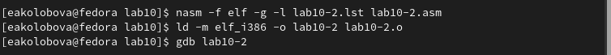
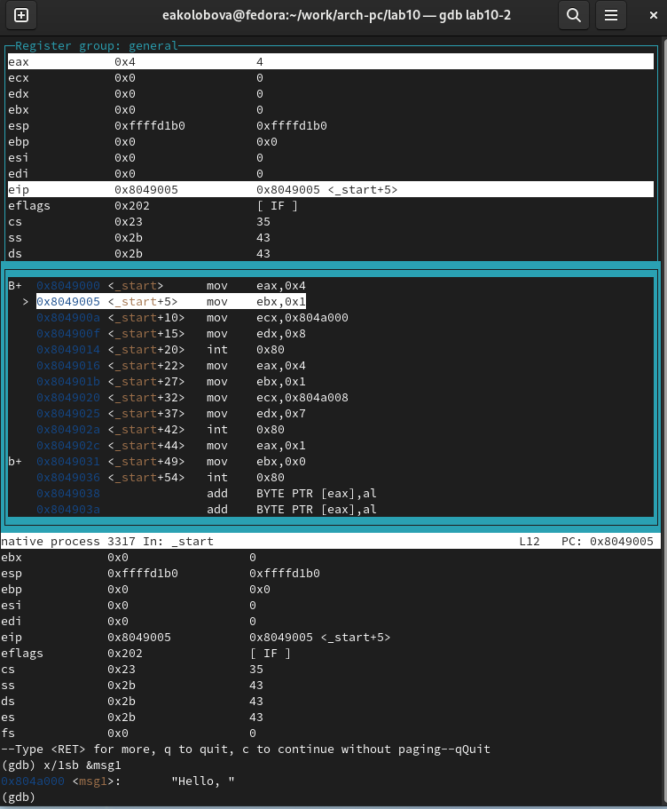
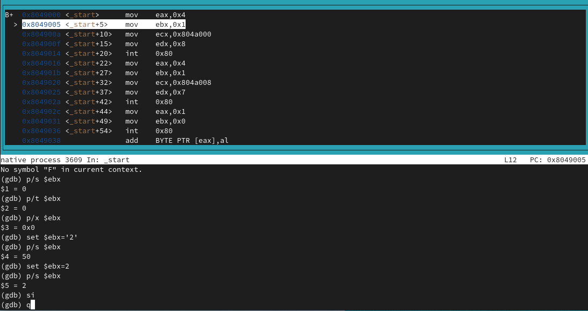
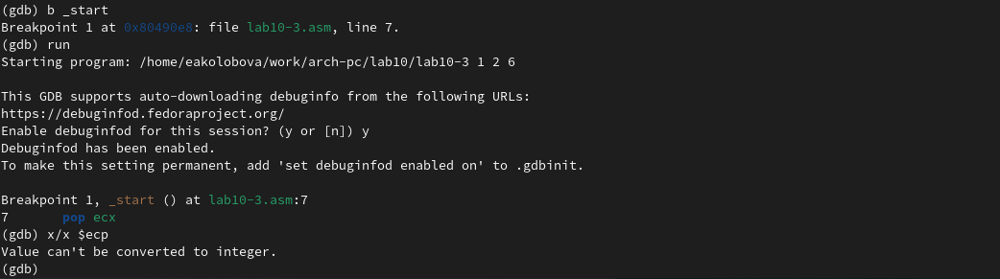
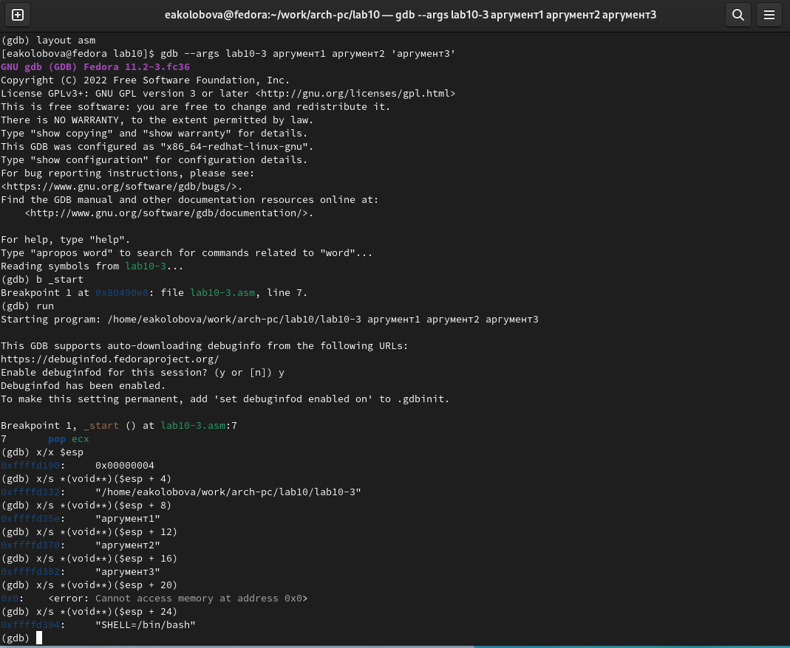
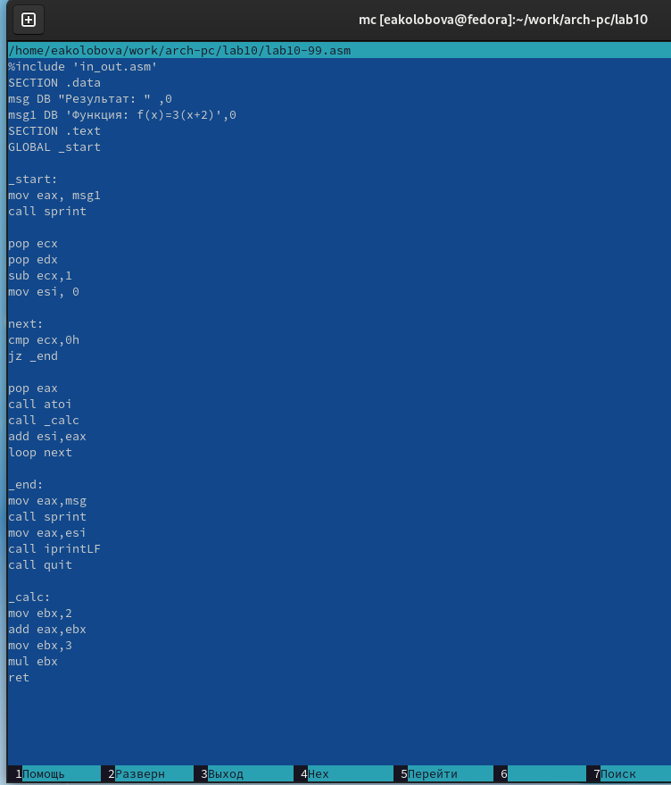
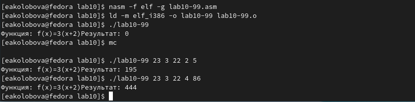
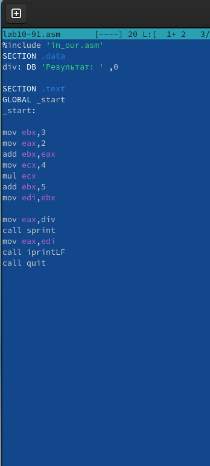
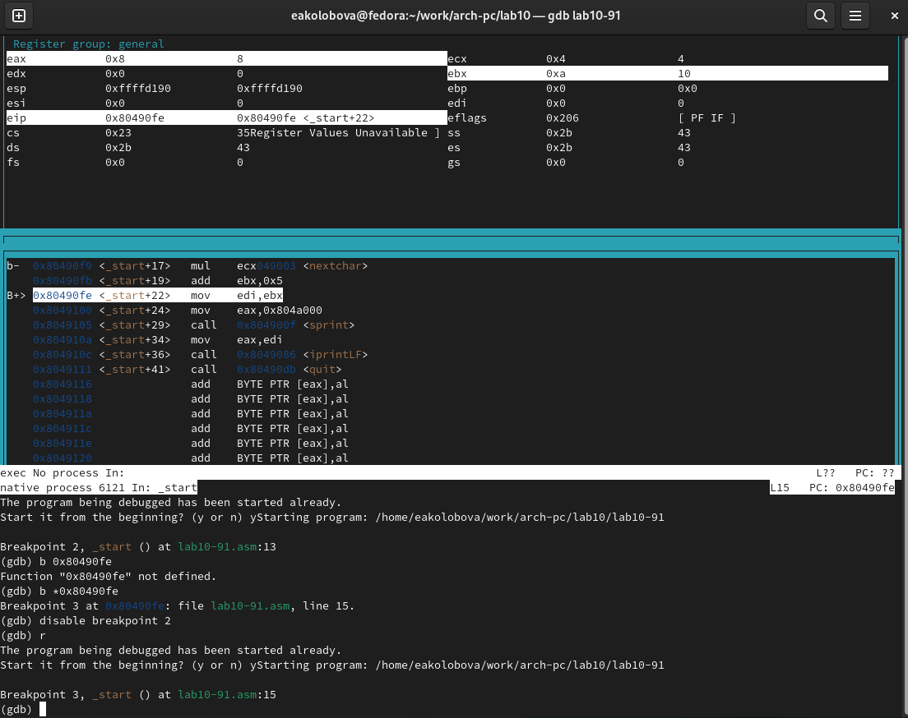

---
## Front matter
title: "**Отчет по лабораторной работе №10**"
subtitle: "дисциплина: Архитектура компьютера"
author: "Колобова Елизавета Андреевна гр. НММбд-01"

## Generic otions
lang: ru-RU
toc-title: "Содержание"

## Bibliography
bibliography: bib/cite.bib
csl: pandoc/csl/gost-r-7-0-5-2008-numeric.csl

## Pdf output format
toc: true # Table of contents
toc-depth: 2
lof: true # List of figures
lot: true # List of tables
fontsize: 12pt
linestretch: 1.5
papersize: a4
documentclass: scrreprt
## I18n polyglossia
polyglossia-lang:
  name: russian
  options:
	- spelling=modern
	- babelshorthands=true
polyglossia-otherlangs:
  name: english
## I18n babel
babel-lang: russian
babel-otherlangs: english
## Fonts
mainfont: PT Serif
romanfont: PT Serif
sansfont: PT Sans
monofont: PT Mono
mainfontoptions: Ligatures=TeX
romanfontoptions: Ligatures=TeX
sansfontoptions: Ligatures=TeX,Scale=MatchLowercase
monofontoptions: Scale=MatchLowercase,Scale=0.9
## Biblatex
biblatex: true
biblio-style: "gost-numeric"
biblatexoptions:
  - parentracker=true
  - backend=biber
  - hyperref=auto
  - language=auto
  - autolang=other*
  - citestyle=gost-numeric
## Pandoc-crossref LaTeX customization
figureTitle: "Рис."
tableTitle: "Таблица"
listingTitle: "Листинг"
lofTitle: "Список иллюстраций"
lotTitle: "Список таблиц"
lolTitle: "Листинги"
## Misc options
indent: true
header-includes:
  - \usepackage{indentfirst}
  - \usepackage{float} # keep figures where there are in the text
  - \floatplacement{figure}{H} # keep figures where there are in the text
---

# **Цель работы**

Целью работы является приобретение приобретение навыков написания программ с использованием подпрограмм и знакомство с методами отладки при помощи GDB и его основными возможностями.


# **Выполнение лабораторной работы**
1. Создадим каталог для программам лабораторной работы No 10, перейдем в
него и создадим файл lab10-1.asm (рис. [-@fig:001]):
```
mkdir ~/work/arch-pc/lab10
cd ~/work/arch-pc/lab10
touch lab10-1.asm 
```

{ #fig:001 width=70% }

2. Рассмотрим программу вычисления арифметического
выражения f(x)=2x+7 с помощью подпрограммы _calcul. В данном
примере x вводится с клавиатуры, а само выражение вычисляется в подпрограмме.
Введем в файл lab10-1.asm текст программы из листинга 10.1. Создадим
исполняемый файл и проверим его работу (рис. [-@fig:002]), рис. [-@fig:003]).

{ #fig:002 width=70% }

{ #fig:003 width=70% }

3. Изменим текст программы, добавив подпрограмму _subcalcul в подпро-
грамму _calcul, для вычисления выражения f(g(x)), где x вводится с клавиату-
ры, f(x)=2x+7, g(x)=3x-1. Т.е. x передается в подпрограмму _calcul из нее
в подпрограмму _subcalcul, где вычисляется выражение g(x), результат воз-
вращается в _calcul и вычисляется выражение f(g(x)). Результат возвращается
в основную программу для вывода результата на экран. (рис. [-@fig:004], [-@fig:005]):

{ #fig:004 width=70% }

{ #fig:005 width=70% }

4. Создадим файл lab10-2.asm с текстом программы из Листинга 10.2. (Программа 
печати сообщения Hello world!) (рис. [-@fig:006])

{ #fig:006 width=70% }

Получим исполняемый файл. Для работы с GDB трансляцию программ
необходимо проводить с ключом ‘-g’. (рис. [-@fig:007])
```
nasm -f elf -g -l lab10-2.lst lab10-2.asm
ld -m elf_i386 -o lab10-2 lab10-2.o
```
Загрузим исполняемый файл в отладчик gdb  (рис. [-@fig:007]):
```
user@dk4n31:~$ gdb lab10-2
```
{ #fig:007 width=70% }

Проверим работу программы, запустив ее в оболочке GDB с помощью команды run (рис. [-@fig:008]):
```
(gdb) run
Starting program: ~/work/arch-pc/lab10/lab10-2
Hello, world!
[Inferior 1 (process 10220) exited normally]
(gdb)
```
Для более подробного анализа программы установим брейкпоинт на метку
_start, с которой начинается выполнение любой ассемблерной программы, и
запустим её. (рис. [-@fig:008])
```
(gdb) break _start
Breakpoint 1 at 0x8049000: file lab10-2.asm, line 12.
(gdb) run
Starting program: ~/work/arch-pc/lab10/lab10-2
Breakpoint 1, _start () at lab10-2.asm:12
12 mov eax, 4
```
Посмотрим дисассимилированный код программы с помощью команды
disassemble начиная с метки _start (рис. [-@fig:008])
```
(gdb) disassemble _start
```
Переключимся на отображение команд с Intel’овским синтаксисом, введя
команду set disassembly-flavor intel (рис. [-@fig:008])
```
(gdb) set disassembly-flavor intel
(gdb) disassemble _start
```
{ #fig:008 width=70% }

Перечислите различия отображения синтаксиса машинных команд в режимах
ATT и Intel.

5. Включим режим псевдографики для более удобного анализа программы (рис. [-@fig:009]):
```
(gdb) layout asm
(gdb) layout regs
```
Установим еще одну точку останова по адресу инструкции. Определим адрес
предпоследней инструкции (mov ebx,0x0) и установим точку останова. (рис. [-@fig:009])

{ #fig:009 width=70% }

Посмотрим информацию о всех установленных точках останова (рис. [-@fig:0010]):
```
(gdb) i b
```
{ #fig:0010 width=70% }

Посмотрим значение переменной msg1 по имени (рис. [-@fig:0011])
```
(gdb) x/1sb &msg1
0x804a000 <msg1>: "Hello, "
```
{ #fig:0011 width=70% }

Посмотрим значение переменной msg2 по адресу. Посмотрим инструкцию mov
ecx,msg2 которая записывает в регистр ecx адрес перемененной msg
Изменим первый символ переменной msg1 (рис. [-@fig:0012]):
```
(gdb) set {char}msg1='h'
(gdb) x/1sb &msg1
0x804a000 <msg1>: "hello, "
(gdb)
```
Заменим символ во второй переменной msg2.
Выведем в различных форматах (в шестнадцатеричном формате, в двоичном
формате и в символьном виде) значение регистра edx. (рис. [-@fig:0012])

{ #fig:0012 width=70% }

С помощью команды set изменим значение регистра ebx (рис. [-@fig:0013]):
```
(gdb) set $ebx='2'
(gdb) p/s $ebx
$3 = 50
(gdb) set $ebx=2
(gdb) p/s $ebx
$4 = 2
(gdb)
```
{ #fig:0013 width=70% }

Объясните разницу вывода команд p/s $ebx.
Эта команда выводит строку, оканчивающуюся нулем.

Завершим выполнение программы с помощью команды continue (сокра-
щенно c) и выйдем из GDB с помощью команды quit (сокращенно q). (рис. [-@fig:0014])

{ #fig:0014 width=70% }

6. Скопируем файл lab9-2.asm, созданный при выполнении лабораторной ра-
боты No9, с программой выводящей на экран аргументы командной строки
(Листинг 9.2) в файл с именем lab10-3.asm (рис. [-@fig:0015]):
```
cp ~/work/arch-pc/lab09/lab9-2.asm ~/work/arch-pc/lab10/lab10-3.asm
```
Создадим исполняемый файл. (рис. [-@fig:0015])
```
nasm -f elf -g -l lab10-3.lst lab10-3.asm
ld -m elf_i386 -o lab10-3 lab10-3.o
```
Загрузим исполняемый файл в отладчик, указав аргументы (рис. [-@fig:0015]):
```
gdb --args lab10-3 аргумент1 аргумент 2 'аргумент 3'
```
{ #fig:0015 width=70% }

Для начала установим точку останова перед первой инструкцией в программе
и запустим ее. (рис. [-@fig:0016])
```
(gdb) b _start
(gdb) run
```
Адрес вершины стека хранится в регистре esp и по этому адресу располагается 
число равное количеству аргументов командной строки (включая имя программы):
```
(gdb) x/x $esp
0xffffd200: 0x05
```
Как видно, число аргументов равно 5 – это имя программы lab10-3 и непо-
средственно аргументы: аргумент1, аргумент, 2 и 'аргумент 3'.
Посмотрим остальные позиции стека (рис. [-@fig:0017])

Почему шаг изменения адреса равен 4, т.к. программа запускается с четырьмя (вместе с названием программы) аргументами

{ #fig:0016 width=70% }

{ #fig:0017 width=70% }

## **Задание для самостоятельной работы**
1. Преобразовать программу из лабораторной работы No9 (Задание No1 для
самостоятельной работы), реализовав вычисление значения функции f(x),
как подпрограмму.
(рис. [-@fig:0024], [-@fig:0025])
 
{ #fig:0024 width=70% }

{ #fig:0025 width=70% }

2. В листинге 10.3 приведена программа вычисления выражения (3+2)*4+5.
При запуске данная программа дает неверный результат. Проверить это.
С помощью отладчика GDB, анализируя изменения значений регистров,
определить ошибку и исправить ее.

Как видно на рис. [-@fig:0028], [-@fig:0029], результат сложения 3+2 записывается в регистр ebx,
а перемножаются после этого значения регистров ecx и eax вместо ecx и ebx, как предполагается в тексте программы. После этого к значению регистра ebx - 5 - прибавляется 5, и этот результат программа выводит, как конечное значение. Ошибка заключается в том, что для операции умножения суммы на значение ecx, первый множитель - сумма - находится в регистре ebx, а умножается всегда регистр eax.
(рис. [-@fig:0026], [-@fig:0028], [-@fig:0029])
 
{ #fig:0026 width=70% }

{ #fig:0028 width=70% }

{ #fig:0029 width=70% }

Ссылка на репозиторий: https://github.com/eakolobova/study_2022-2023_arch-pc/tree/master/labs/lab010/report

# **Выводы**

Результатом проведенной работы является приобретение приобретение навыков написания программ с использованием подпрограмм и знакомство с методами отладки при помощи GDB и его основными возможностями.
