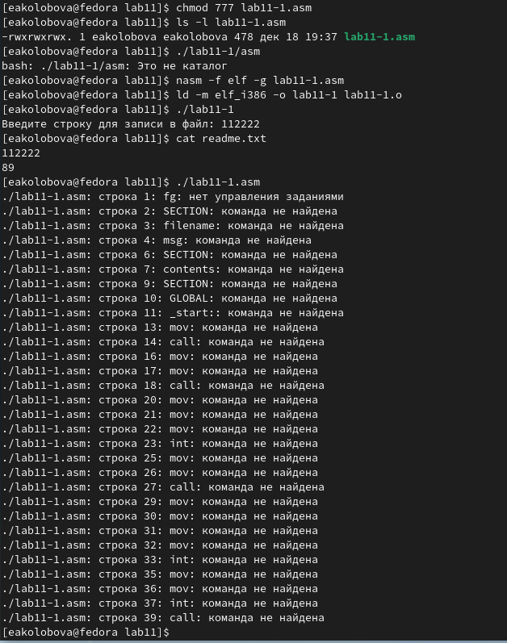
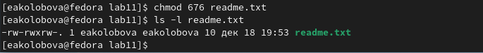
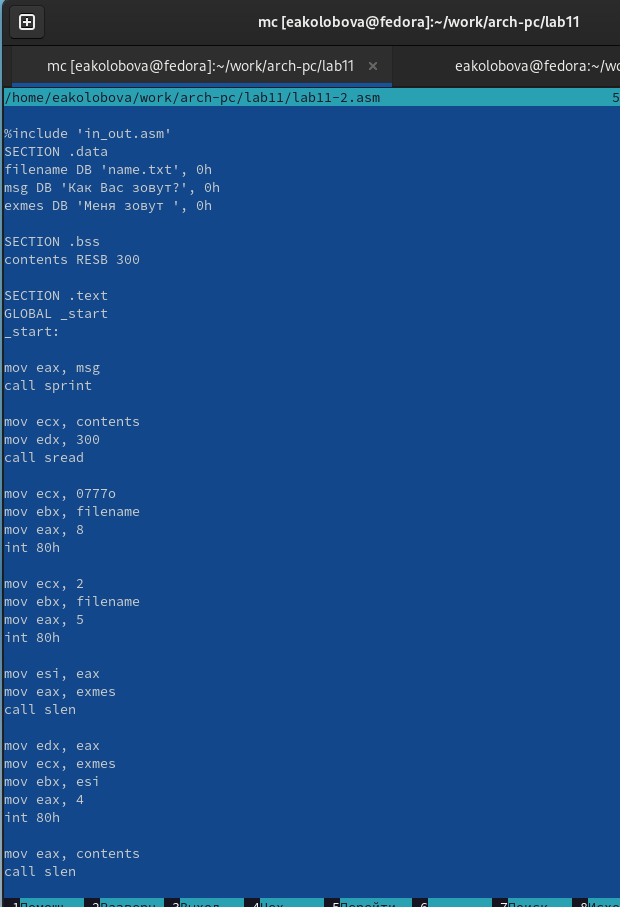
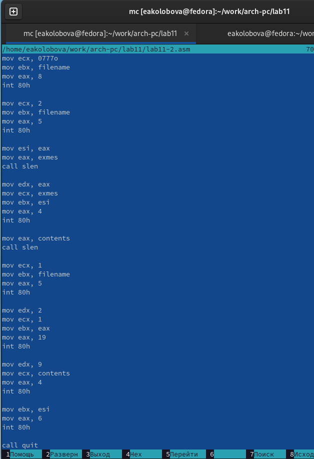
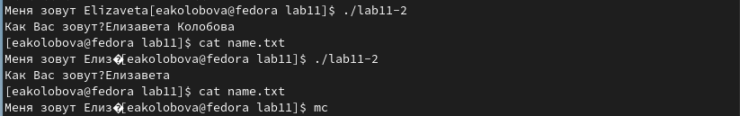

---
## Front matter
title: "**Отчет по лабораторной работе №11**"
subtitle: "дисциплина: Архитектура компьютера"
author: "Колобова Елизавета Андреевна гр. НММбд-01"

## Generic otions
lang: ru-RU
toc-title: "Содержание"

## Bibliography
bibliography: bib/cite.bib
csl: pandoc/csl/gost-r-7-0-5-2008-numeric.csl

## Pdf output format
toc: true # Table of contents
toc-depth: 2
lof: true # List of figures
lot: true # List of tables
fontsize: 12pt
linestretch: 1.5
papersize: a4
documentclass: scrreprt
## I18n polyglossia
polyglossia-lang:
  name: russian
  options:
	- spelling=modern
	- babelshorthands=true
polyglossia-otherlangs:
  name: english
## I18n babel
babel-lang: russian
babel-otherlangs: english
## Fonts
mainfont: PT Serif
romanfont: PT Serif
sansfont: PT Sans
monofont: PT Mono
mainfontoptions: Ligatures=TeX
romanfontoptions: Ligatures=TeX
sansfontoptions: Ligatures=TeX,Scale=MatchLowercase
monofontoptions: Scale=MatchLowercase,Scale=0.9
## Biblatex
biblatex: true
biblio-style: "gost-numeric"
biblatexoptions:
  - parentracker=true
  - backend=biber
  - hyperref=auto
  - language=auto
  - autolang=other*
  - citestyle=gost-numeric
## Pandoc-crossref LaTeX customization
figureTitle: "Рис."
tableTitle: "Таблица"
listingTitle: "Листинг"
lofTitle: "Список иллюстраций"
lotTitle: "Список таблиц"
lolTitle: "Листинги"
## Misc options
indent: true
header-includes:
  - \usepackage{indentfirst}
  - \usepackage{float} # keep figures where there are in the text
  - \floatplacement{figure}{H} # keep figures where there are in the text
---

# **Цель работы**

Целью работы является приобретение навыков написания программ для работы с файлами.


# **Выполнение лабораторной работы**
1. Создаем каталог для программам лабораторной работы No 11, переходим в
него и создаем файлы lab11-1.asm и readme.txt(рис. [-@fig:001]):

```
mkdir ~/work/arch-pc/lab11
cd ~/work/arch-pc/lab11
touch lab11-1.asm readme.txt
```

{ #fig:001 width=70% }

2. Введем в файл lab11-1.asm текст программы из листинга 11.1 (Программа
записи в файл сообщения). Создадим исполняемый файл и проверим его
работу. (рис. [-@fig:002], [-@fig:003]).

{ #fig:002 width=70% }

{ #fig:003 width=70% }

3. С помощью команды chmod изменим права доступа к исполняемому файлу
lab11-1, запретив его выполнение. Попытаемся выполнить файл. Т.к. выполнение файла
было запрещено, в терминал выводится соответствующее сообщение о запрете исполнения.(рис. [-@fig:004]):

{ #fig:004 width=70% }

4. С помощью команды chmod изменим права доступа к файлу lab11-1.asm с
исходным текстом программы, добавив права на исполнение. Попытаемся
выполнить его. Так как права на исполнение были добавлены, программа работает(рис. [-@fig:0033]):

{ #fig:0033 width=70% }

5. Предоставим права доступа к файлу readme.txt в соответствии с вариантом
в таблице 11.4. (Вариант 7: rw- rwx rw-) Проверим правильность выполнения с помощью
команды ls -l. (рис. [-@fig:006])

{ #fig:006 width=70% }

## **Задание для самостоятельной работы**
1. Написать программу работающую по следующему алгоритму:
 1. Вывод приглашения “Как Вас зовут?”
 2. ввести с клавиатуры свои фамилию и имя
 3. создать файл с именем name.txt
 4. записать в файл сообщение “Меня зовут”
 5. дописать в файл строку введенную с клавиатуры
 6. закрыть файл
Создать исполняемый файл и проверить его работу. Проверить наличие файла
и его содержимое с помощью команд ls и cat (рис. [-@fig:0018], [-@fig:0011], [-@fig:0019])
 
{ #fig:0018 width=70% }

{ #fig:0011 width=70% }

{ #fig:0019 width=70% }

Ссылка на репозиторий: https://github.com/eakolobova/study_2022-2023_arch-pc/tree/master/labs/lab011/report

# **Выводы**

Результатом проведенной работы является приобретение навыков написания программ для работы с файлами.
